# Customer Database REST API (OpenAPI 3.0)


---

# Table of Contents
- [1. Introduction](#introduction)

- [2. App Connect Toolkit - Prepare API](#toolkit-prepare-api)
	* [2a. Import CustomerDatabaseJava.zip](#import-cdb-java)
	* [2b. Create CustomerDatabaseV2 REST OpenAPI 3](#create-openapi)

- [3. App Connect Toolkit - Implement API](#toolkit-implement-api)
	* [3a. Implement getCustomers subflow](#get_customers)
	* [3b. Implement addCustomer subflow](#add_customer)
	* [3c. Implement getCustomer subflow](#get_customer)
	* [3d. Implement updateCustomer subflow](#update_customer)
	* [3e. Implement deleteCustomer subflow](#delete_c_ustomer)

- [4. Deploy](#deploy)

- [5. Test the API](#testing)

- [6. Summary](#summary)

---

# 1. Introduction <a name="introduction"></a>
In this lab, you will build Customer Database REST API using IBM App Connect Enterprise (ACE) Toolkit. You will implement CRUD operations along with the GET Operations.<br>

# 2. App Connect Toolkit - Prepare API <a name="toolkit-prepare-api"></a>

Open ACE Toolkit, and create workspace for lab1.<br>


## 2a. Import CustomerDatabaseJava.zip <a name="import-cdb-java"></a>

**Download CustomerDatabaseJava.zip** from [<b><u>HERE</u></b>](./resources/CustomerDatabaseJava.zip)</b>

**Download openapi.json** from [<b><u>HERE</u></b>](./resources/openapi.json)</b>

Import CustomerDatabaseJava.zip into the Toolkit.<br>

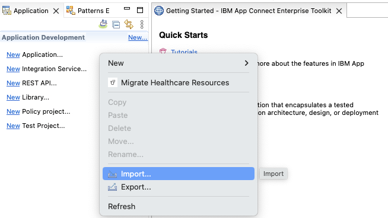

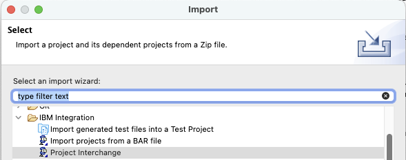

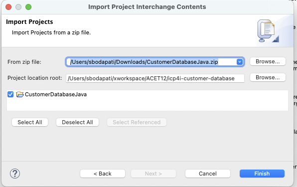


## 2b. Create CustomerDatabaseV2 REST OpenAPI 3   <a name="create-openapi"></a>


Type CustomerDatabaseV2 and click Finish.<br>


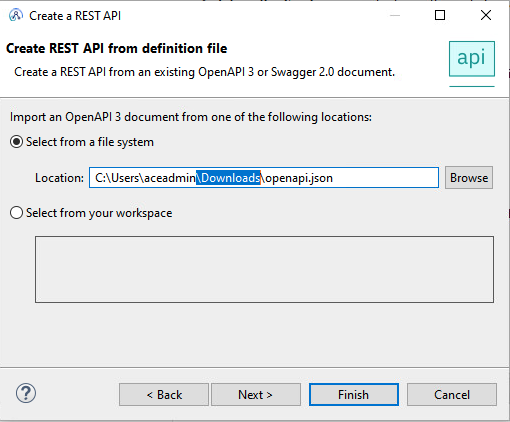

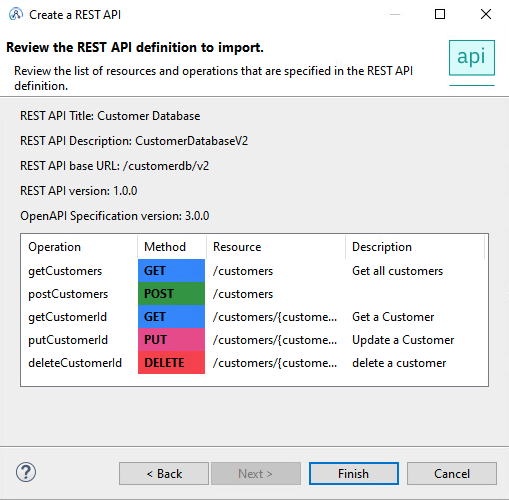

Click \<Finish\>. <br>

**Set CustomerDatabaseJava as a referenced Project**
<br>
Right click on CustomerDatabaseV2 > Properties > Project References > Check mark "CustomerDatabaseJava" project. <br>


<br><br>
<br>


# 3. App Connect Toolkit - Implement API <a name="toolkit-implement-api"></a>

## 3a. Implement getCustomers subflow <a name="get_customers"></a>


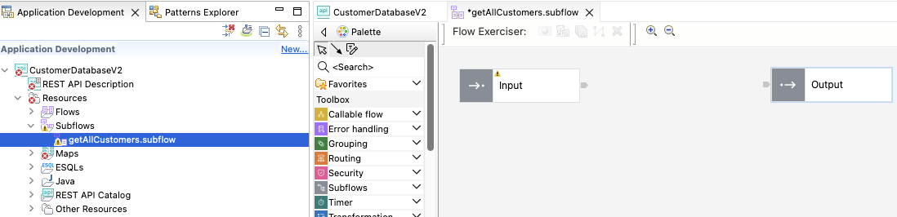

Drag and drop Compute Node from the Transformation pallete.<br>
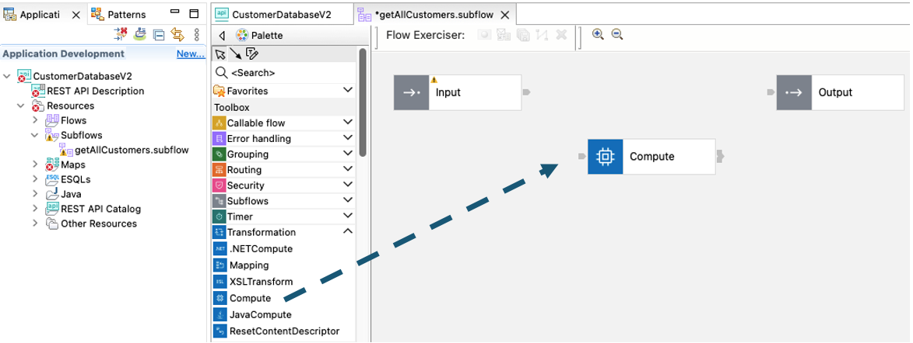

Double click on the Compute Node to open an ESQL Editor.<br>

Copy and paste the below PROCEDURE in the top.<br>
```
CREATE PROCEDURE getAllCustomers ( IN max INTEGER, INOUT output REFERENCE )
LANGUAGE JAVA
EXTERNAL NAME "CustomerDatabase.getAllCustomers";
```

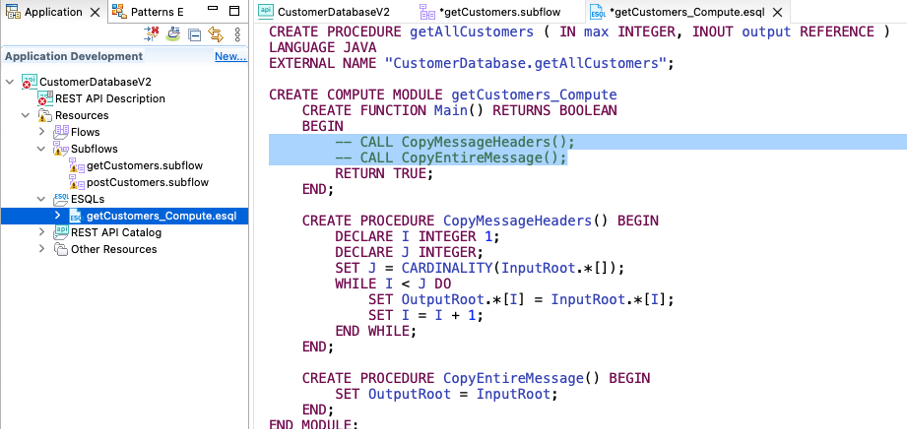

Copy and paste the below code between the BEGIN and END of the Main() function.
```
		-- Copy the headers over, but do not copy any message body.
		CALL CopyMessageHeaders();
		-- Process the 'max' parameter from the inbound request.
		-- If it is not specified, then default to -1 (all of the customers).
		DECLARE max INTEGER -1;
		IF FIELDTYPE(InputLocalEnvironment.REST.Input.Parameters.max) IS NOT NULL THEN
			-- Set up a handler for cast exceptions, and then attempt to cast the parameter to an integer.
			DECLARE EXIT HANDLER FOR SQLSTATE LIKE '%'
			BEGIN
				SET OutputLocalEnvironment.Destination.HTTP.ReplyStatusCode = 400;
				SET OutputRoot.JSON.Data.error = 'The value provided for the ''max'' parameter is not a valid integer.';
				RETURN TRUE;
			END;
			SET max = CAST(InputLocalEnvironment.REST.Input.Parameters.max AS INTEGER);

		END IF;
		-- Create a top level JSON array that will hold the customer records.
		CREATE LASTCHILD OF OutputRoot DOMAIN('JSON');
		SET OutputRoot.JSON.Data TYPE = JSON.Array;
		DECLARE output REFERENCE TO OutputRoot.JSON.Data;
		-- Retrieve the customer records by calling Java code.
		CALL getAllCustomers(max, output);
		RETURN TRUE;
```
Right click and click "Format" to format the ESQL code. <br>
Save (Control + s), and close the ESQL editor. <br>

Now, connect the nodes. <br>
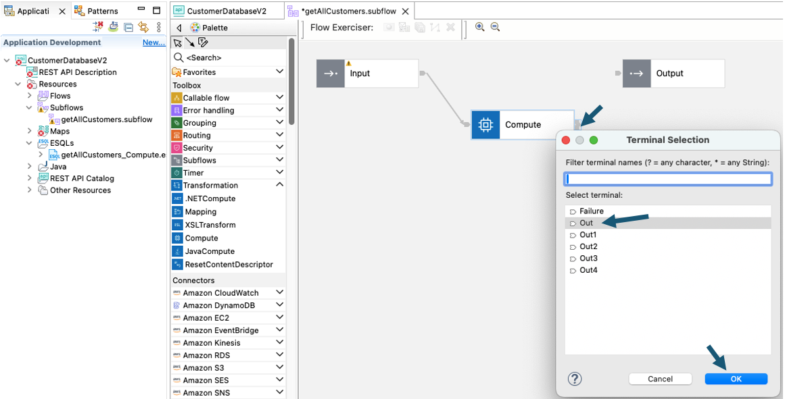

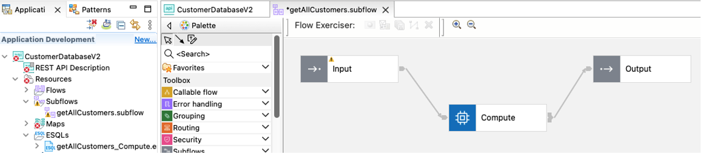

Hit Control+s to save the flow. <br><br>


## 3b. Implement addCustomer subflow <a name="add_customer"></a>

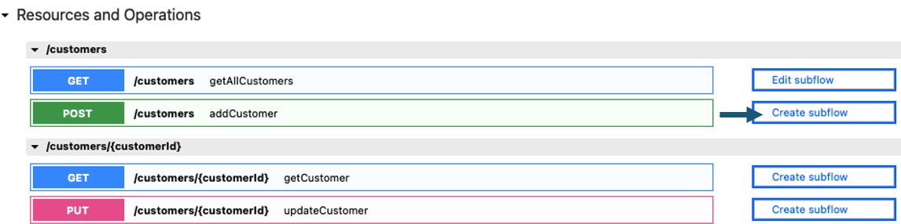

Drag and drop a mapping node into the canvas.<br>

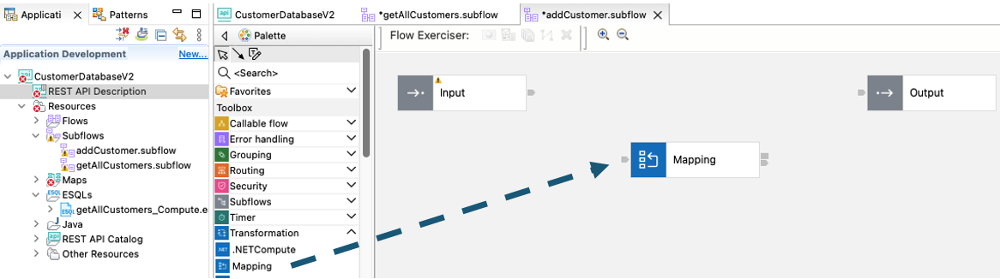

Double click on the mapping node.<br>

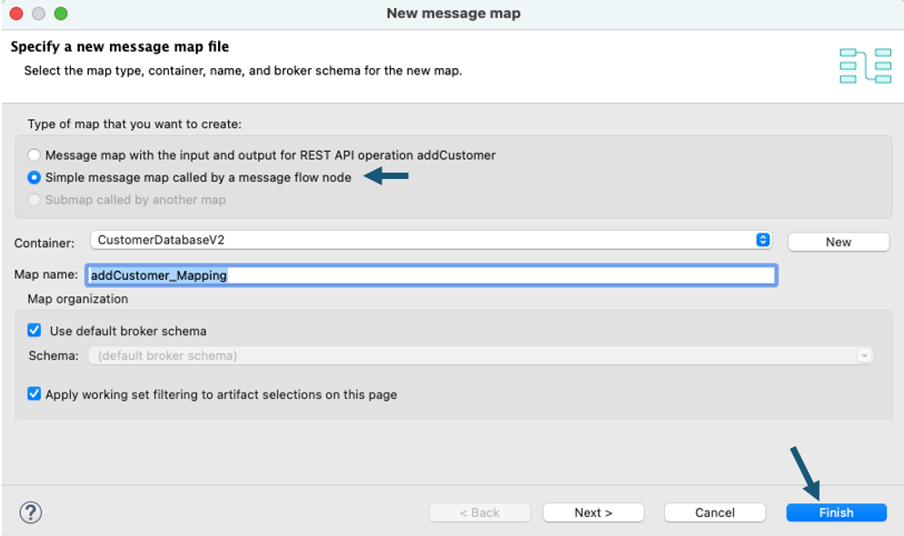


Expand JSON domains on both Input and Output Assemblies. <br>
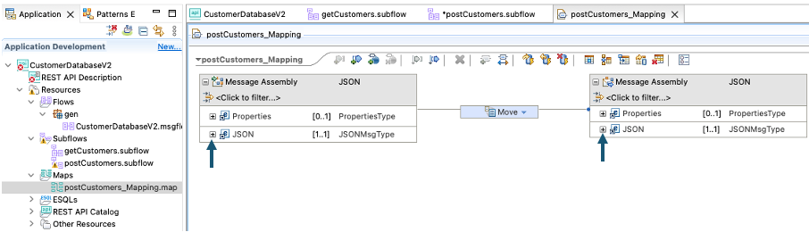


Now we are going add User-Defined elements firstname, lastname, and address. <br>

Hover over on any field to popup "Add userdefined element" icon.<br>
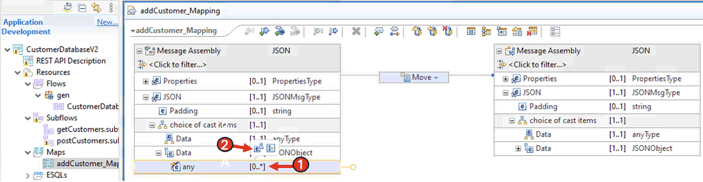


Replace element1 with firstname.<br>


Repeat the above and add two more UserDefined fields lastname, and address. <br>


Connect Input JSONObject to Output JSONObject as shown below.<br>
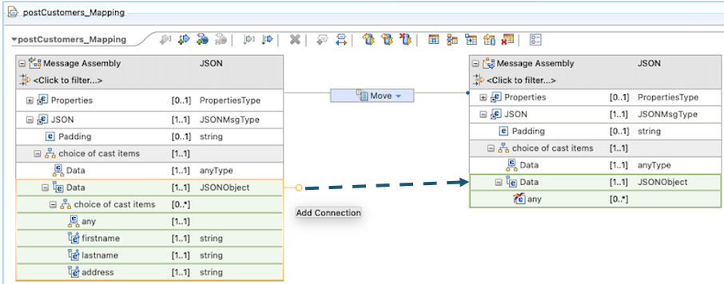

Replace Move Transform with CustomJava Transform. Click on the Move dropdown icon as below.<br>


Now Expand Custom Transform, and select Custom Java Transform function.<br>


Click on <b>Custom Java</b> and select Browse to select CustomerDtaabase Java Class, and for the Method select addCustomer.<br>

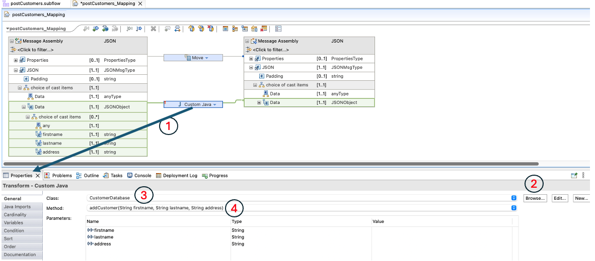

Browse and type Customer to view Customer* classes. Select CustomerDatabase.java.<br>
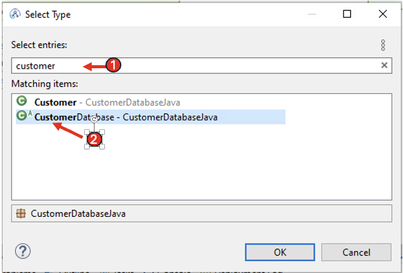

Now, assign payload data firstname, lastname, address data to the CustomerDatabase/addCustomer method parameters.<br>
Click Value column of the firstname and select "Edit Custom XPath expression.".<br>
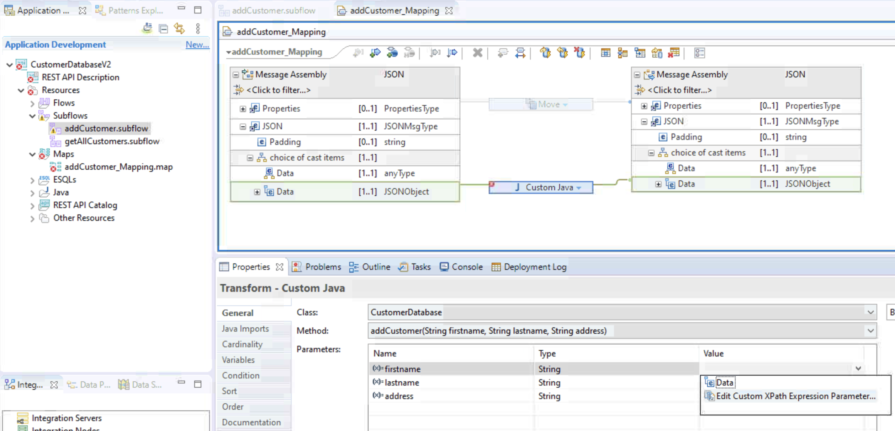

Custom XPath Builder opens.<br>


Hit Control+Spacebar to view the suggested fields.<br>
Expand $Data (Input JSONObject), and select firstname.<br>


Similarly, assign lastname, address fields as below.<br>


Hit Control + S to save, and close the map. <br>

Now wire the Input Node > Mapping Node In Terminal, and Mapping Node Out Terminal > Output Node In Terminal as below.<br>


Hit Control + S to save, and close the subflow. <br>
<br>


## 3c. Implement getCustomer subflow <a name="get_customer"></a>


Drag and drop Mapping Node from the Tranformation pallete. <br>


Select map type. <br>
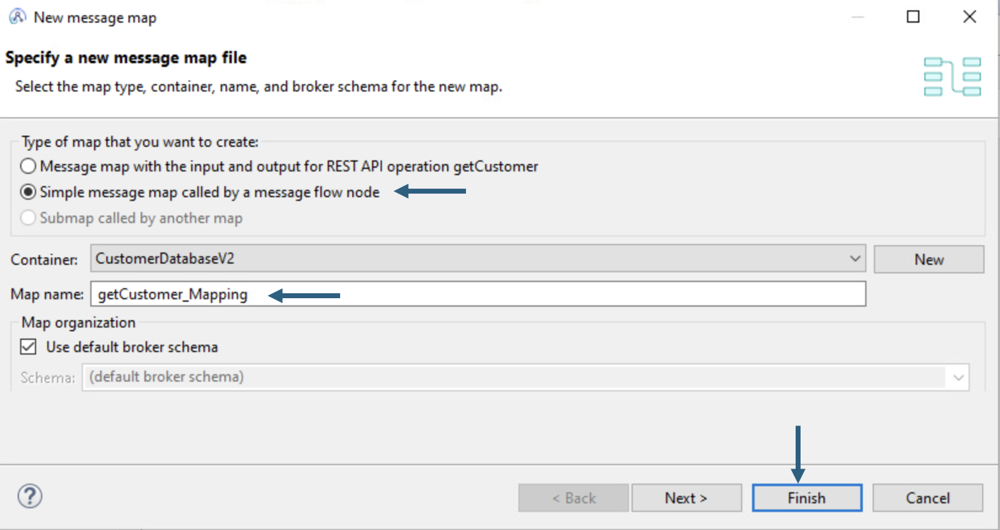

Select map inputs and outputs.<br>
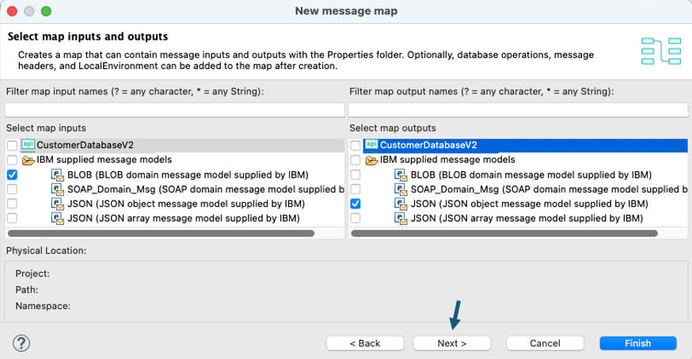

Select the domain to create the output.<br>
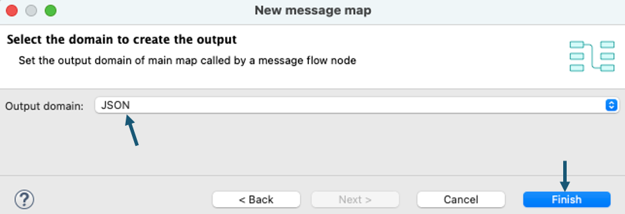

Now your map look like this (default).<br>
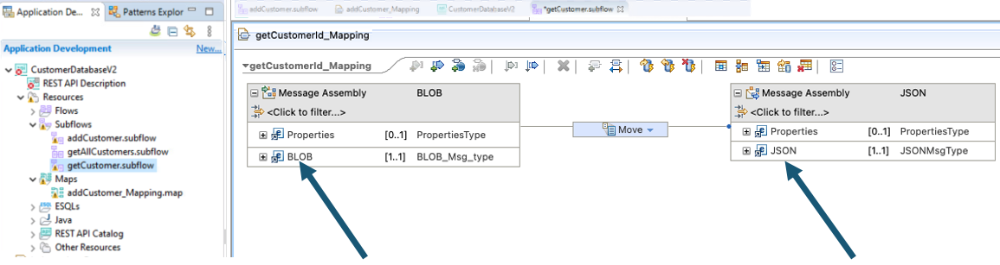

Add or remove headers and folders. Right click in the middle of the Message Assembly on left of the map.<br>
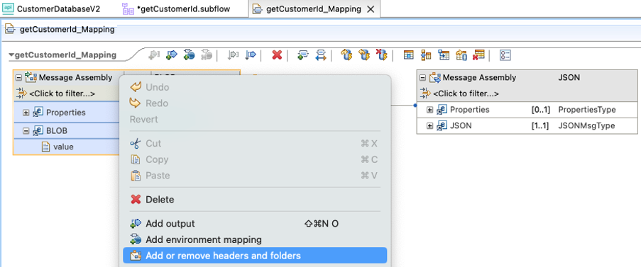

Add LocalEnvironment header, and remove Properties header.<br>


Similarly, repeat the above step on the Output Message Assembly.<br>


Remove \"Move\" Operation.<br>


Add CustomerDatabase JavaImport as below.<br>
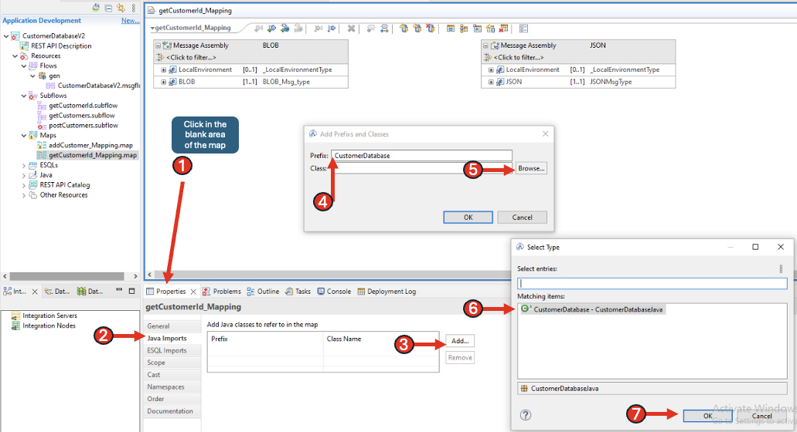

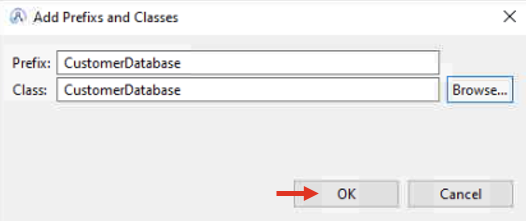

Add \"User Defined\" variable as described below. <br>
In the input message assemtbly, expand LocalEnvironment Segment.<br>
Navigate to the REST > Input > Parameters section.<br>

Click 1:1 of \"any\" variable and hover over 1:1 to see two small icons and click on the first one which is "Add User-defined".<br>
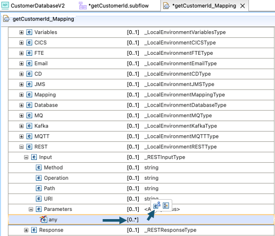

"element1" will be added.<br>
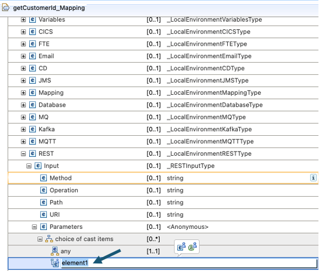

Rename "element1" to "customerId".<br>


<br>
<b>Lets create a if/else condition.</b>

Drag customerId to Message Asseembly. This will create <b>\"For Each\"</b>, but we will change it <b>\"if\"</b>, then to <b>Condition</b> section.<br>

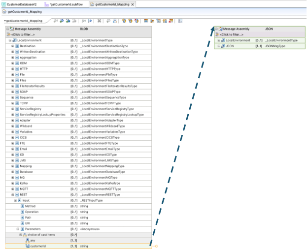

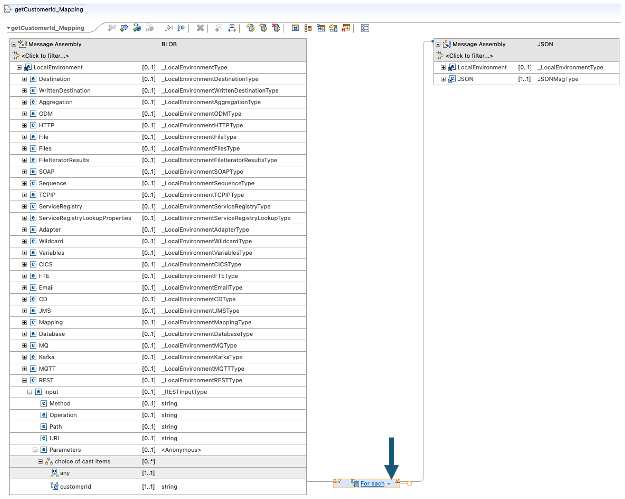

Click on the dropdown/twisty to select \"if\". <br>


Hover over \"if\" to see \"Add Else\" icon.<br>
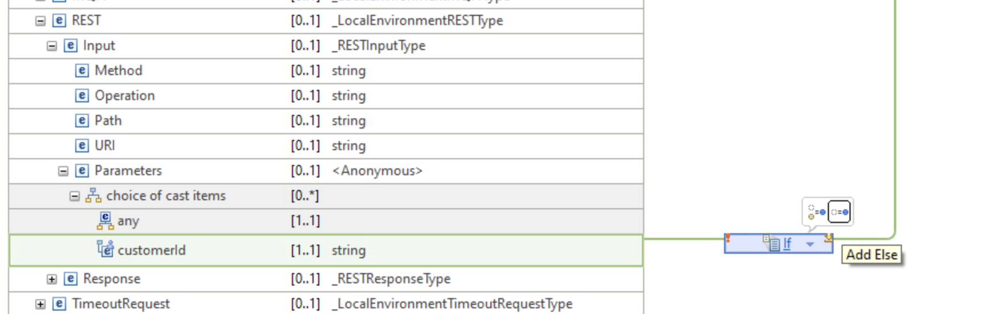

if/else condition section.<br>


Implement if Condition. <br>


Type customer in the blank area and select CustomerDatabase:customerExists(int) method.<br>


Pick the customerId field which is being passed. You can use Control + Space as below<br>


The condition should look like this.<br>
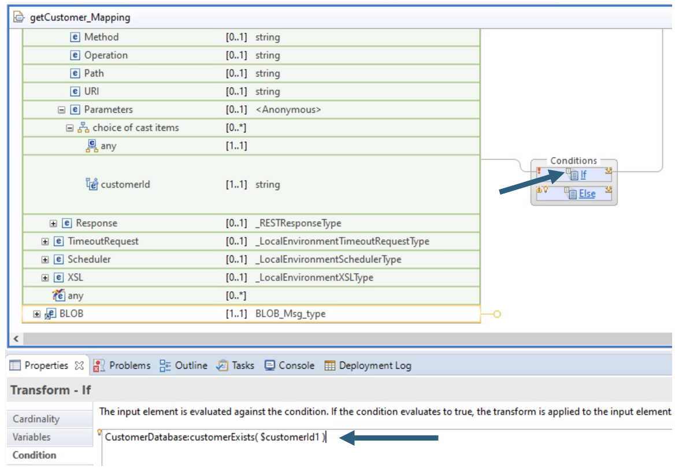

Hit Control + s, to save the map. <br>
<br>

Click the <b>Edit</b> icon to implement the if condition.<br>
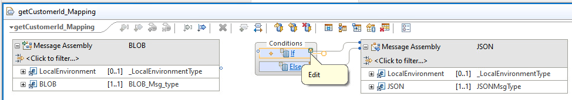


Replace "For Each" with "Custom Java". <br>


Click on "Custom Java", and click the Properties tab in the bottom pane.<br>


Browse and select "CustomerDatabase" and getCustomer(int id) method.<br>

Under the Parameters section, under Value for id click the blank area and select "customerId".<br>


Now, <br>
a) wire "Custom Java" to Data segment of the JSON Output as below.<br>
b) Add error "User-defined" variable as you have done earlier.<br>

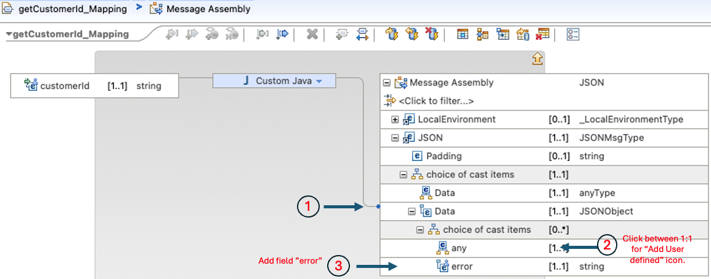

Implement Else. Wire the Else to the Message Assembly.<br>
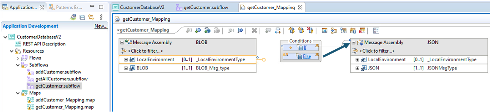


Now click on Else to Assign Output values.<br>


Expand LocalEnvironment tree. <br>
Expand Destination > HTTP. Drag ReplyStatusCode to the left and release. That action will generate "Assign" transform.<br>
In the bottom Properties tab, assgin value 404 as below.<br>


Collapse LocalEnvironment and expand JSON tree.<br>

Assign **"A customer with the specified ID does not exist in the Customer Database".**<br>

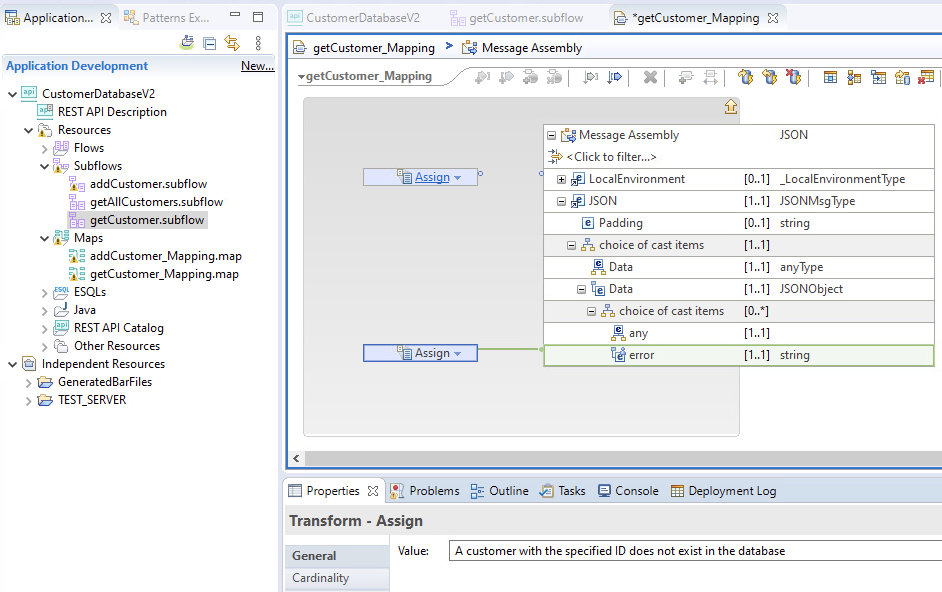

Hit Control + S to save the map and close the map and click Ok if asked the map to be saved.<br>
<br>
Wire the Input Node > Mapping Node and Mapping Node's Out > Output Node's In Terminal. <br>

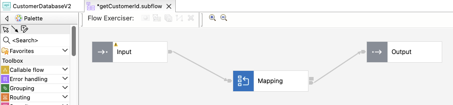

Save and close the subflow and the map. <br>
<br>


## 3d. Implement updateCustomer subflow <a name="update_customer"></a>

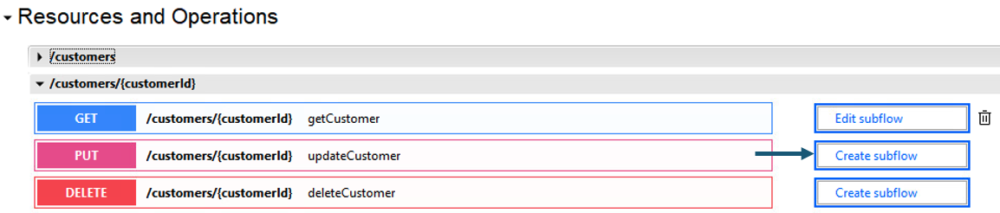

Drag and drop Mapping Node. <br>


Wire Input, Mapping, and Output Nodes as below.<br>
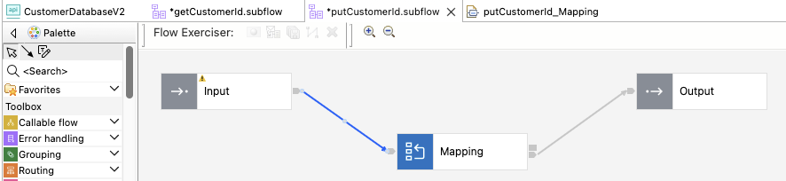

**Implement map:** Double click on the mapping node.<br>

Select type of map, Change the name to "updateCustomer_Mapping". <br>


\<Next\><br>

Select map input, and output to be JSON Object.<br>


Select the JSON Domain.<br>


\<Finish\> <br>

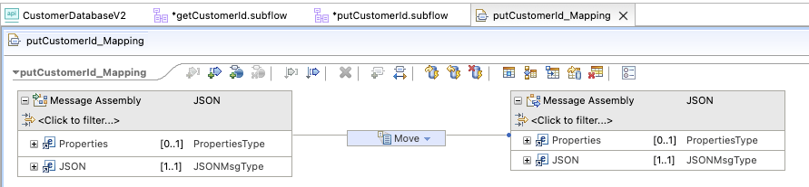

Delete the \"Move\" connection. <br>


<br>

**Add or remove headers folders.**<br>

Hover over on the "Message Assembly" on left to view square box. Click on the square box to see the Message Assembly popup.<br>


Click on "Header Properties". <br>
Uncheck "Properties", and check "LocalEnvironment". <br>
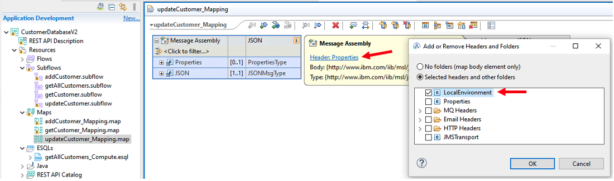

Repeat the same on the right side Message Assembly. <br>


Expand "LocalEnvironment", navigate to REST Segment > Input > Parameters section.<br>

Add "User Defined" variable. Click 1:1 of "any" variable and hover over 1:1 to see two small icons and click on the first one which is "Add User-defined".<br>

Rename "element1" to "customerId".


Expand JSON Domain and add 3 User-defined fields as below.<br>
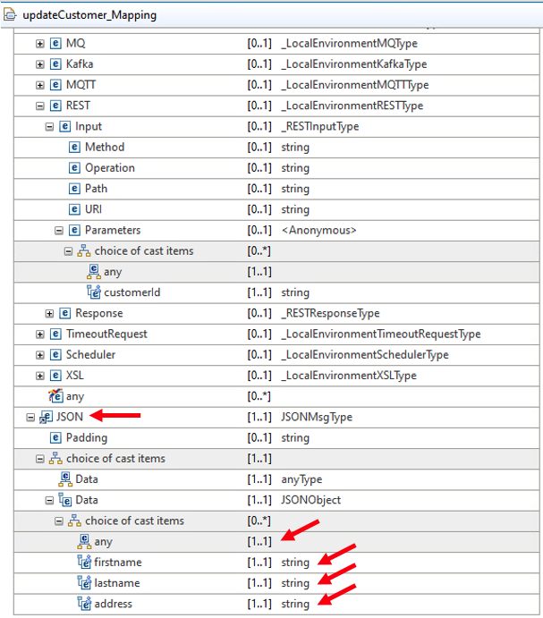


Add "CustomerDatabase" Java Import.<br>
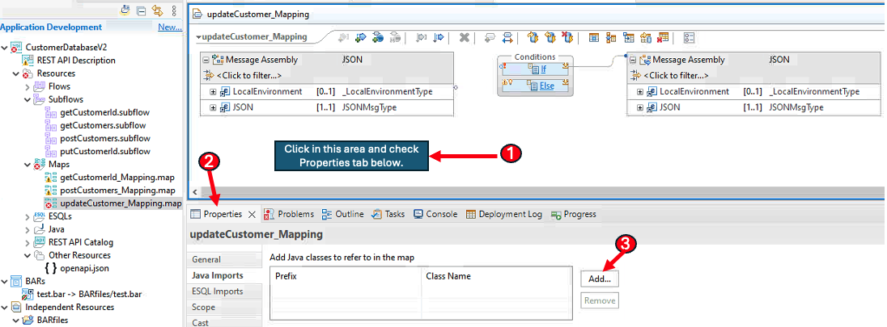


**Lets create a if/else condition.**<br>

Connect Input Message Assembly to the Output Message Asseembly. This will create "Submap" Transform. Change "Submap" to "If" Transform <br>

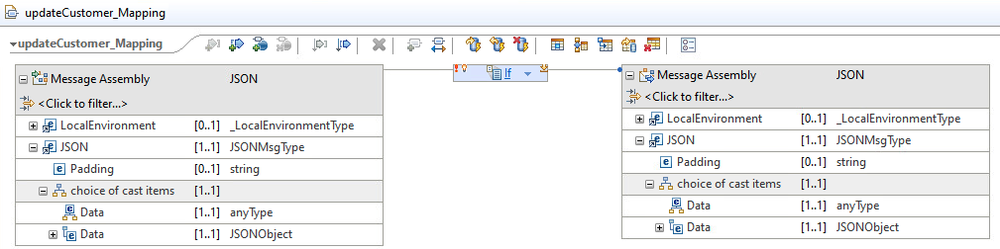


Add an "Else" Condition.<br>


Now, click on "if" condition and check the Properties tab.<br>
Click on "Condition" tab, and Control+Spacebar to select CustomerDatabase:customerExists() method.<br>


Now, use Control+Spacebar and select $MessageAssembly/LocalEnvironment/REST/Input/Parameters/customerId as below.
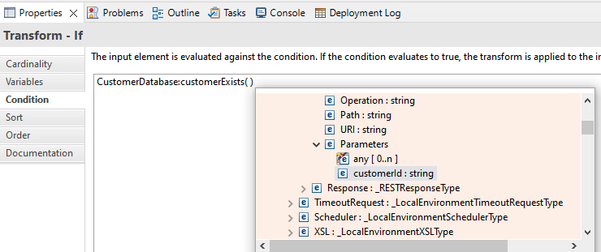

Hit Control+s and save the map. <br>

Implement "If" condition, if the customerExists() is true.<br>


Add User-Defined variable called "error".<br>
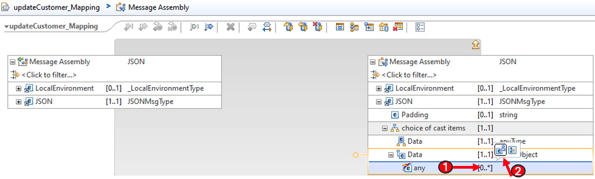


Add "Custom Java" Connection on "Data" JSONObject .<br>

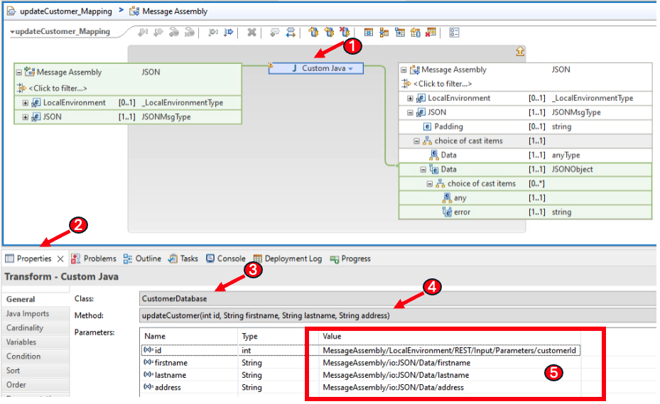
id: $MessageAssembly/LocalEnvironment/REST/Input/Parameters/customerId<br>
firstname: $MessageAssembly/io:JSON/Data/firstname<br>
lastname: firstname: $MessageAssembly/io:JSON/Data/lastname<br>
address: firstname: $MessageAssembly/io:JSON/Data/address<br>

Save and close the Map, and the Subflow.
<br><br>


## 3d. Implement deleteCustomer subflow <a name="delete_customer"></a>


Drag and drop a JavaCompute Node. <br>
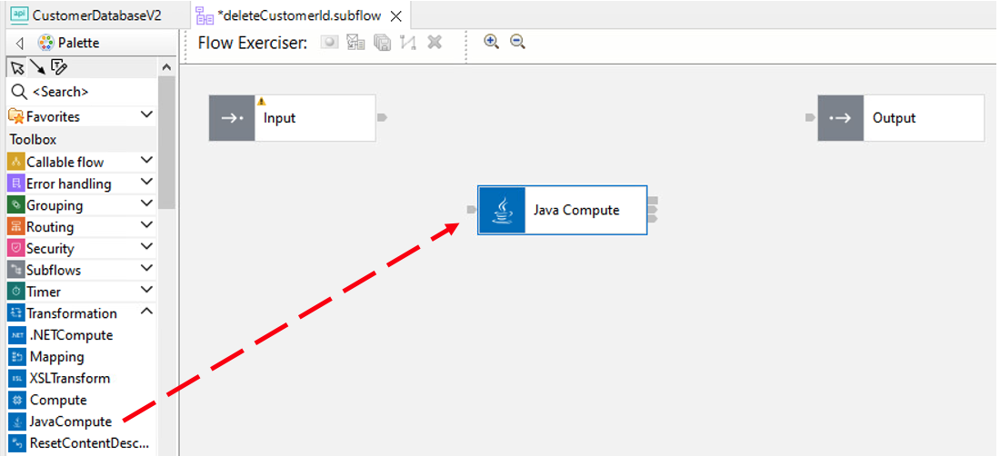

Connect the Nodes as below. <br>
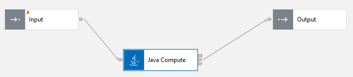


<br>

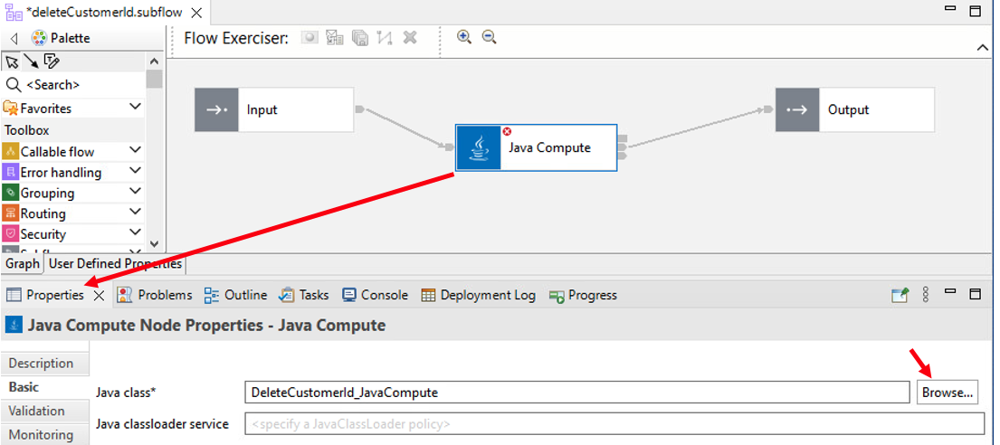

<br>


Save and close the Subflow.<br>
<br>
<br>


# 4. Deploy <a name="deploy"></a>


**Create BAR (Broker Archite) file.**

Right click on CustomerDatabaseV2 project, and select "New" > select "BAR file".<br>
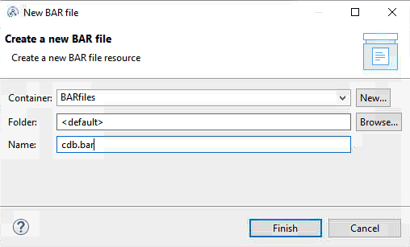

Select the REST API.<br>


**Deploy BAR (Broker Archite) file.**

Create a Local Integration Server.<br>


Keep the default name "TEST_SERVER", and click "Finish".<br>

Drag and drop the cdb.bar file into the TEST_SERVER as below.<br>


# 5. Testing <a name="testing"></a>

**Take a small break!!!**


Start Web User Interface. <br>


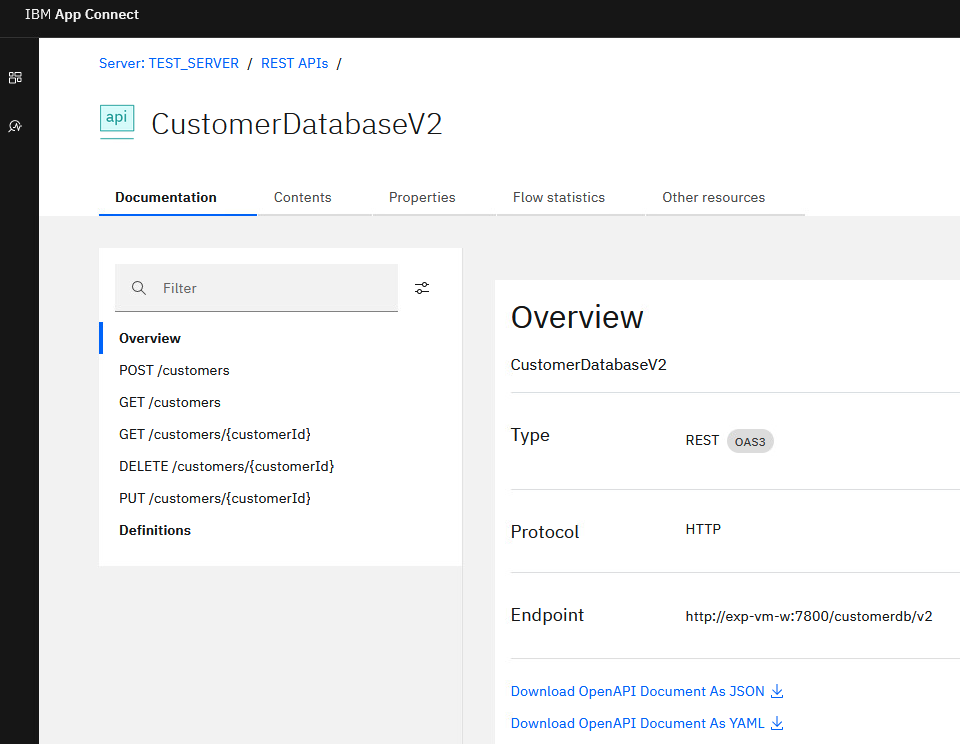


Lets run some simple tests from the Terminal.<br>

### GET /customers
curl -H "Content-Type: application/json" --request GET --url http://localhost:7800/customerdb/v2/customers

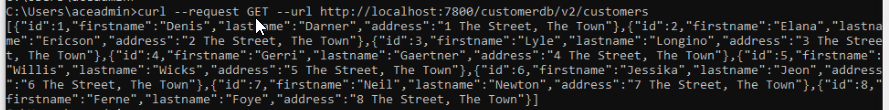

### POST /customers
```
curl -H "Content-Type: application/json" --request POST --url http://localhost:7800/customerdb/v2/customers --data "{\"firstname\": \"Sudhakar\", \"lastname\": \"Bodapati\", \"address\": \"123 Drexel Hill, Mullica Hill, NJ\"}"
```


Now, run GET /customers to see if the new Customer added.<br>
```
curl -H "Content-Type: application/json" --request GET --url http://localhost:7800/customerdb/v2/customers
```


### GET /customers/{customerId}
```
curl -H "Content-Type: application/json" --request GET --url http://localhost:7800/customerdb/v2/customers/9
```


### PUT /customers/{customerId} - Update Customer address
```
curl -H "Content-Type: application/json" --request PUT --url http://localhost:7800/customerdb/v2/customers/9 --data "{\"firstname\": \"Sudhakar\", \"lastname\": \"Bodapati\", \"address\": \"123 Drexel Hill Drive, Mullica Hill, NJ\"}"
```


-- GET /customers/9
```
curl -H "Content-Type: application/json" --request GET --url http://localhost:7800/customerdb/v2/customers/9
```


### DELETE /customers/{customerId}
```
curl -H "Content-Type: application/json" --request DELETE --url http://localhost:7800/customerdb/v2/customers/9
```


-- GET /customers/9
```
curl -H "Content-Type: application/json" --request GET --url http://localhost:7800/customerdb/v2/customers/9
```
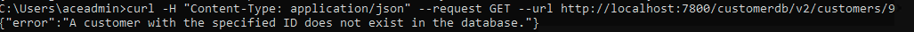


# 5. Summary <a name="summary"></a>


Congratulations! You have successfully created a REST OpenAPI 3.0 using IBM App Connect Toolkit.
<br>