# How to use a Change Data Capture node in IBM App Connect to stream changes from a Postgres Database.

---

# Table of Contents
- [1. Introduction](#introduction)
- [2. Postgres - create database and sample data ](#postgres-db)
- [3. App Connect Toolkit](#toolkit)
  * [3a. Open Workspace](#open-workspace)
  * [3b. Create Vault, Credential](#create-vault)
  * [3c. Start Integration Server demo-postgres](#start-is)
  * [3d. Create Message Flow](#message-flow)
- [4. Deployment](#deployment)
  * [4a. Connect to Integration Server ](#integration-server)
  * [4b. Deploy Policy, Application](#deploy)
- [5. Testing](#testing)
  * [5a. Insert new record ](#testing-new-record)
  * [5b. Update record ](#testing-update-record)
- [6. Summary ](#summary)
- [7. Miscellaneous ](#misc)
  * [7a. Postgres installation on RHEL ](#postgres-install)
---

<br>

## 1. Introduction <a name="introduction"></a>
In this lab, you will explore the Change Data Capture (CDC) Node of the App Connect Enterprise (ACE) Toolkit to capture records in real-time from a Postgres database table. <br>


Diagram: <br>
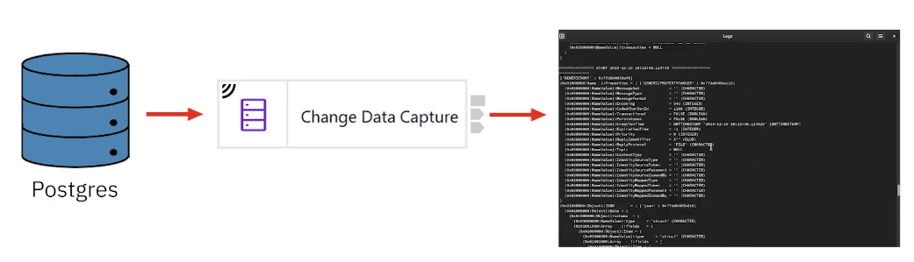


Workshop environment. <br>


You will be doing this lab from the Windows VM. <br>
<br>


## 2. Postgres - create database and sample data <a name="postgres-db"></a>

Let's create Postgres database called demo. <br>

From the Windows VM, open Putty program. Open "ibmace1" RHEL VM. <br>

Login as "ibmuser" and enter the following commands. <br>

```
sudo –u postgres psql

postgres=# CREATE DATABASE demo;

postgres=# \c demo

demo=# \d

demo=# CREATE table pirates(
id INT NOT NULL, 
name VARCHAR (30),
power VARCHAR(30),
PRIMARY KEY (id));

demo=# \d pirates

demo=# INSERT INTO pirates(id, name, power) VALUES(1, 'luffy', 'rubber');
INSERT INTO pirates(id, name, power) VALUES(2, 'zoro', '3 swords');
INSERT INTO pirates(id, name, power) VALUES(3, 'nami', 'navigator');
INSERT INTO pirates(id, name, power) VALUES(4, 'usopp', 'lying');
INSERT INTO pirates(id, name, power) VALUES(5, 'buggy', 'chop-chop');
INSERT INTO pirates(id, name, power) VALUES(6, 'sanji', 'chef kicks');
INSERT INTO pirates(id, name, power) VALUES(7, 'chopper', 'doctor reindeer');

demo=# \d pirates

demo=# select * from pirates;

### Lets not to use postgres user in ACE flow, lets setup a new user for ACE message flow.
demo=# CREATE ROLE dbz REPLICATION LOGIN PASSWORD 'dbz123';

### grant create previlage on the demo database
demo=# GRANT CREATE ON DATABASE demo TO dbz;

### swap owner from postgres to dbz
demo=# ALTER TABLE pirates OWNER TO dbz;

### grant dbz role to postgres 
demo=# GRANT dbz TO postgres;


## quit postgres user
demo=# \q

## now lets login as dbz user
[ibmuser@ibmace1 ~]$ psql -U dbz -h 127.0.0.1 -d demo
password: dbz123

demo=# \d pirates

## create publication 
demo=# CREATE PUBLICATION dbz_pub FOR TABLE public.pirates;

## see Publication
demo=# \d pirates
demo=# \q
```
<br>


## 3. App Connect Toolkit <a name="toolkit"></a>

From the Windows VM, open IBM App Connect Enterprise Toolkit from the desktop. <br>

### 3a. Open Workspace <a name="open-workspace"></a>

Workspace: C:\Users\techzone\IBM\ACET13\workspace\cdc-demo <br>
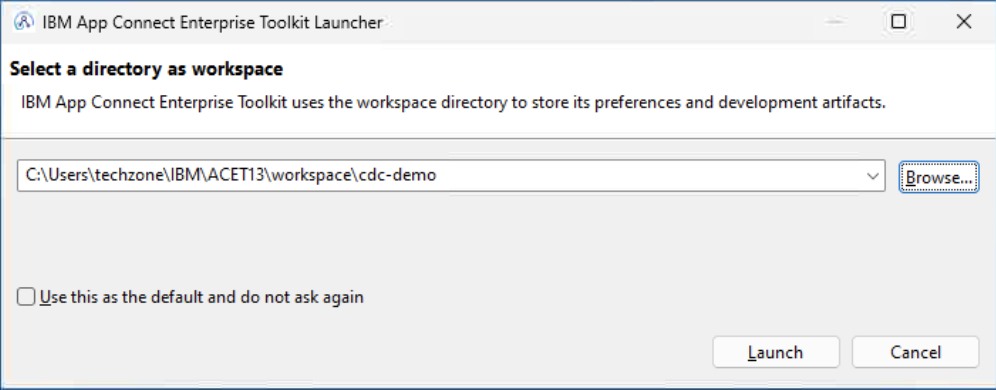

Close the welcome page. <br>

Navigate menu, Window > Show view > Other > search for Terminal > select Terminal and click Open button. <br>


Click the "Launch Terminal" button. <br>


Click Ok. <br>
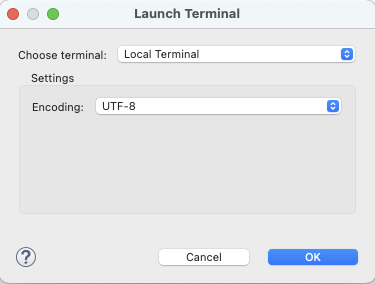

A local Terminal will be added as below. <br>


### 3b. Create Vault, Credential <a name="create-vault"></a>

Create a work directory, and Vault to store credentials. <br>

From the Terminal pane, run the below commands. <br>
```
mqsicreateworkdir ./demo-postgres
```


Create Vault. <br>
```
mqsivault --create --vault-key cdcVaultKey --work-dir ./demo-postgres
```


Create Credential to access demo postgres database. <br>
```
mqsicredentials --create --credential-name cdcPostgres --credential-type cdc --username dbz --password dbz123 --work-dir ./demo-postgres --vault-key cdcVaultKey
```
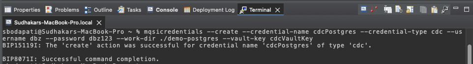

Set JRE version to the latest. <br>
```
ibmint display supported-jre-versions  
ibmint specify jre --version  17 --work-dir ./demo-postgres 
```


### 3c. Start Integration Server demo-postgres <a name="start-is"></a>

Lets start the integration server demo-postgres from the Terminal view of the Toolkit. <br>
```
IntegrationServer --work-dir ./demo-postgres --vault-key cdcVaultKey
```
if prompted to allow access to the Virtual Machine, then click Allow. <br><br>

### 3d. Create Message Flow <a name="message-flow"></a>

Navigate menu, File > New > Application. <br>
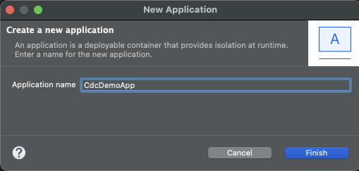

Click New > Message Flow. <br>


Call if "Simple_CDC_MsgFlow", and click Finish. <br>


Drag "Change Data Capture" node into the Message Flow Canvas. <br>


Drag a Trace node into the canvas. <br>
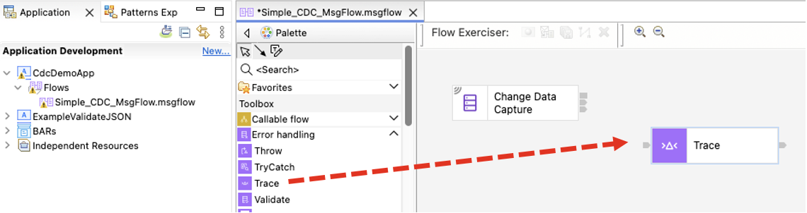

Also, drag a FileOutput Node into the Canvas. <br>


Now, lets wire the nodes as below. <br>


Configure each Node. <br>
Click on "Change Data Capture" Node. Check the Properties view. <br>


Click, Create a policy link. <br>


Create a new Policy project. <br>
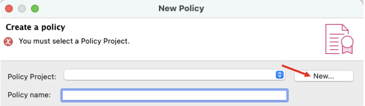

Name it "MyPolicies" and click Finish. <br>
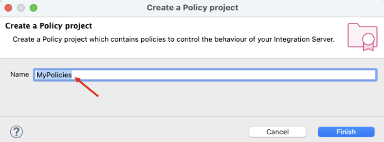


Enter Policy name as "Postgres". <br>
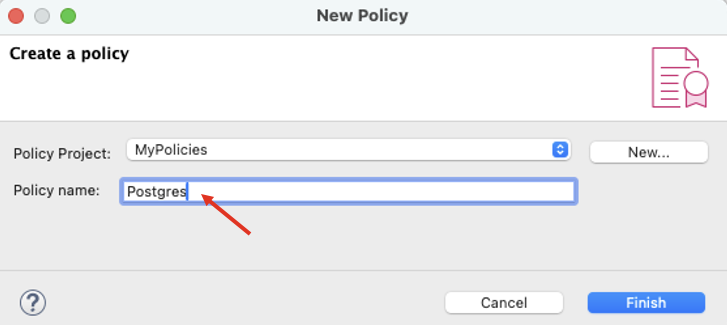

Select Template as PostgreSQL. <br>
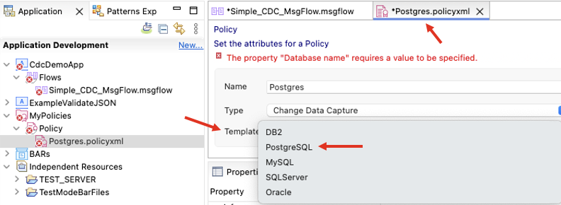

Confirm to switch policy or template ... click OK. <br>


Now, enter Connection details in the Policy configuration. <br>
Host name: 10.0.0.1 <br>
Port number: 5432 <br>
Security identity (DSN): cdcPostgres <br>
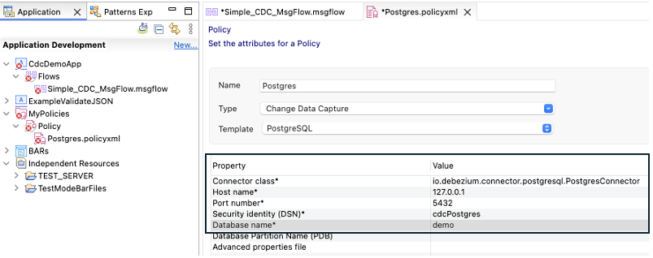
<br>
Hit Control or Command+s to save the policy xml. <br>

Click on the Message flow, and Basic tab. <br>
Add public.pirates table. Click  <br>


Hit Control or Command+s to save the policy xml. <br>


**Configure Trace node.** <br>
Destination: File <br>
File path: C:\temp\cdc_trace.txt <br>
Pattern: (copy/paste the below <br>
```
======= START ${CURRENT_TIMESTAMP} =======
--------------------------------
${Root}
--------------------------------
${Body}

```
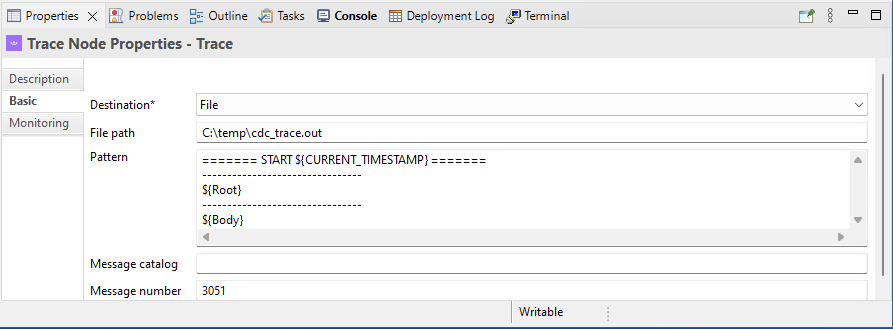

**Configure FileOutput node** directory, and filename. <br>
Directory: C:\temp <br>
File name or pattern: cdc_events.txt <br>


<br>


## 4. Deployment  <a name="deployment"></a>

Lets deploy the Policy project and the Application into the Integration Server you have created and started in above. <br><br>

### 4a. Connect to Integration Server <a name="integration-server"></a>

Connect to the Integration Server as below. <br>


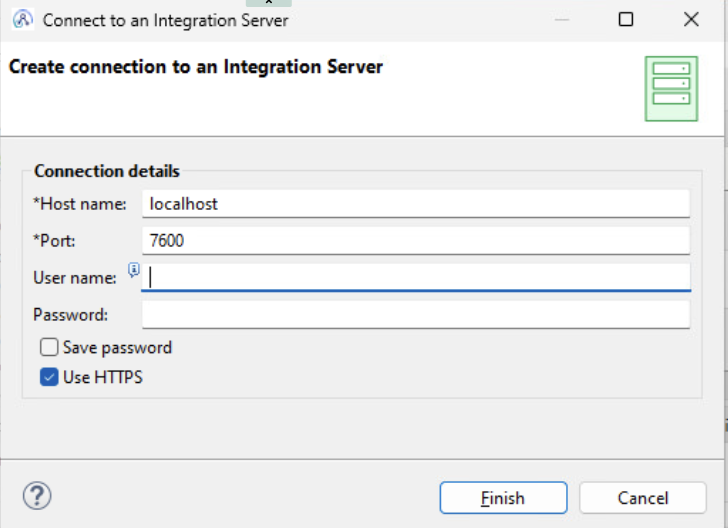

Trust the certificate. <br>


### 4b. Deploy Policy, Application <a name="deploy"></a>


Now, drag and drop the Policy Project and CdcDemoApp into the Integration server demo-postgres. <br>


## 5. Testing <a name="testing"></a>

You should see two files under C:\temp folder. Open each of them and check the data. <br> 
Note that, we are not stripping any segments that is coming out of the CDC connector. <br>
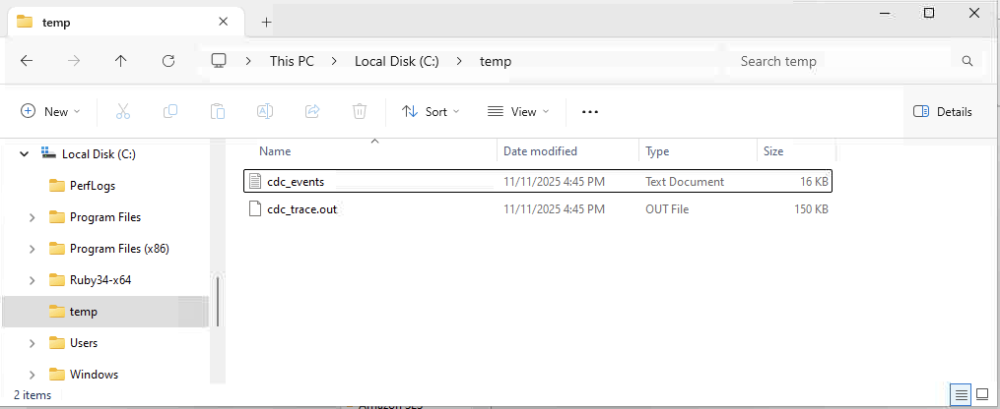

<br>

### 5a. Insert new record <a name="testing-new-record"></a>

Lets add one new record into the demo database. <br>

Logon to ibmace1 VM again as ibmuser, and run the below commands. <br>

```
[ibmuser@ibmace1 ~]$ psql -U dbz -h 127.0.0.1 -d demo
password: dbz123

demo==> INSERT INTO pirates(id, name, power) VALUES(8, 'harry', 'potter');

demo==> select * from pirates;
```

Now, switch back to Windows VM, and check cdc_events.txt file. You should see the new record. <br>

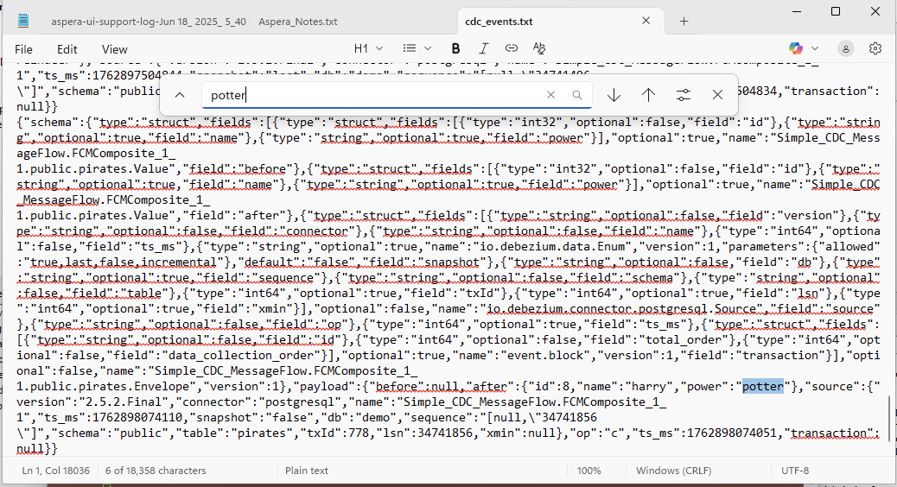
<br>

### 5b. Update record <a name="testing-update-record"></a>
Switch back to ibmace1 VM again as ibmuser, and run the below commands. <br>
```
[ibmuser@ibmace1 ~]$ psql -U dbz -h 127.0.0.1 -d demo
password: dbz123

demo==> UPDATE pirates SET name='Ron', power='magic' where id=8;

demo==> select * from pirates;
```


### 5c. Optional - check cdc_trace.txt <a name="testing-cdc--trace"></a>

Optionally, open C:\temp\cdc_trace.txt file using Notepad++.
<br><br> 

## 6. Summary <a name="summary"></a>

Congratulations! You have successfully generated records in PostgreSQL database and received the records as events using APP Connect Change Data Capture connector.

<br><br><br>


## 7. MISCELLANEOUS <a name="misc"></a>


## 7a. Postgres installation on RHEL <a name="postgres-install"></a>

```
sudo dnf install -y https://download.postgresql.org/pub/repos/yum/reporpms/EL-9-x86_64/pgdg-redhat-repo-latest.noarch.rpm

sudo dnf -qy module disable postgresql

sudo dnf install -y postgresql18-server

sudo /usr/pgsql-18/bin/postgresql-18-setup initdb

sudo systemctl enable postgresql-18

sudo systemctl start postgresql-18
```

```
sudo vi /var/lib/pgsql/18/data/pg_hba.conf
```


```
sudo vi /var/lib/pgsql/data/postgresql.conf
```


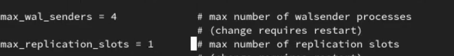

```
sudo systemctl restart postgresql-18
```
