# Using Avro based schemas with Kafka Nodes

---
# Table of Contents
- [1. Introduction](#introduction)
- [2. Workshop Environments ](#workshop-env)
- [3. Capture Kafka Connection detailst](#kafka-details)
- [4. App Connect Toolkit](#toolkit)
  * [4a. Open Workspace](#open-workspace)
  * [4b. Create KafkaProducer Message flow](#message-flow-kafkaproducer)
  * [4c. Configure KakfaProducer Message Flow Nodes](#configure-kafkaproducer-nodes)
- [5. Create Vault, Credentials](#create-credentials)
- [6. Deployment](#deployment)
  * [6a. Create Integration Server](#create-is)
  * [6b. Deploy Policy Project](#deploy-policy)
  * [6c. Deploy Application](#deploy-app)  
- [7. Testing](#testing)
- [8. Using Avro schema ](#using-avro)
- [9. Redeploy Policy and Application ](#redeploy)
- [10. Testing Avro ](#testing-avro)
---

<br>

## 1. Introduction <a name="introduction"></a>
In this lab, you will explore the KafkaProducer Node of the App Connect Enterprise (ACE) Toolkit to utilize and verify input data against an Avro schema. <br>

From ACE 13.0.2.0, you can use Avro based schemas with Kafka nodes to have data serialization and deserialization. <br>

Avro is an open source data serialization format known for its efficiency in storage and speed, particularly in big data environments. It offers advantages in terms of schema evolution, compact binary format, and high performance for write intensive operations, making it suitable for use cases like data streaming with Apache Kafka. <br>

In App Connect v13.0.2, the KafkaProducer node has been enhanced so that the JSON messages parsed into the node can be serialized into Avro format using a referenced Avro schema before it's published to the Kafka topic. <br>

The KafkaConsumer, and KafkaRead nodes have similar properties, but for consuming messages from a topic and deserializing back into JSON. <br>

## 2. Workshop Environments  <a name="workshop-env"></a>


You will be doing this lab from the Windows VM. <br>

Also, a Cloud Pak for Integration Platform having IBM Event Streams capability. <br>


## 3. Capture Kafka connection details <a name="kafka-details"></a>

Login to IBM Event Streams console as student(n). <br>

On the welcome page, click on "Connect to this cluster" tile. <br>

Now, click on "Generate SCRAM credentials". <br>
Name it student(n)-scram-cred. Replace (n) with your student id, example student1. <br>

<Next> <next> <Next> Hit 3 next buttons, and finally hit "Generate credentials". <br>

Copy and Save the credentials into the Notepad on the desktop (lab-notes.txt) as below. <br>
Bootstrap Servers: aaaa <br>
SCRAM username: bbbb  <br>
SCRAM password: cccc <br>


Now, click on the "Basic Authentication token" tab, and copy / paste the "SCRAM Basic Authentication token" into the Notepad as below. <br>
**Basic Authentication Token: dddd** <br>
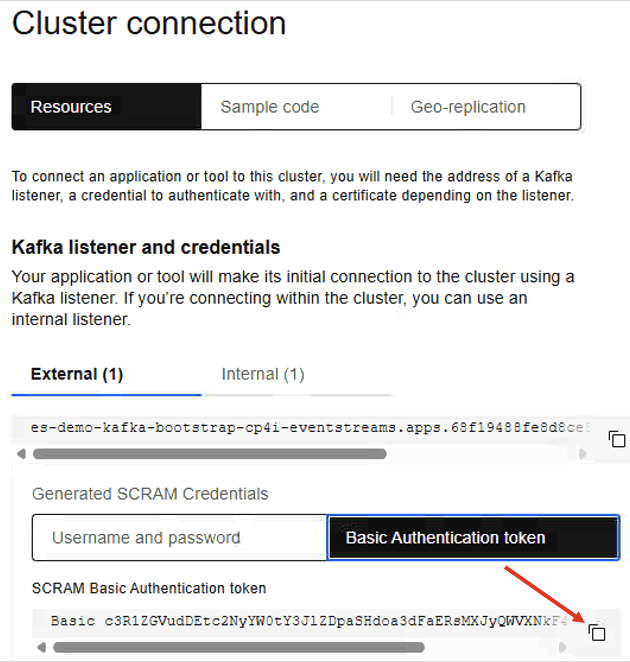

Now, lets **download the PKCS12 certificate.** <br>

Scroll down to the Certificates section, and click "Download Certificate". <br>
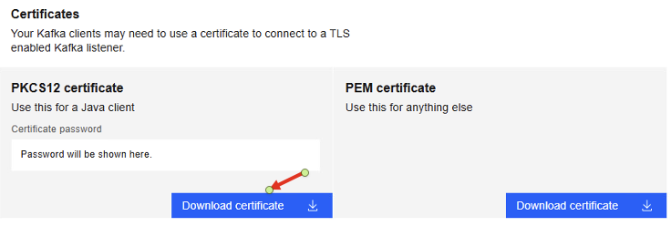

A password should be genrated, copy/paste the password into the Notepad as below. <br>
**Certificate Password: eeee** <br>

You should have captured like this. <br>
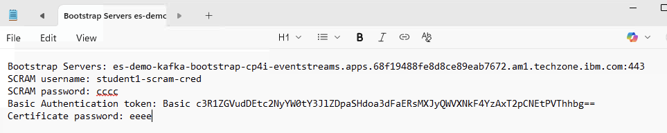


## 4. App Connect Toolkit <a name="toolkit"></a>

From the Windows VM, open IBM App Connect Enterprise Toolkit from the desktop. <br>

### 4a. Open Workspace <a name="open-workspace"></a>

Workspace: C:\Users\techzone\IBM\ACET13\workspace\avro-demo <br>


Close the welcome page. <br>

Navigate menu, Window > Show view > Other > search for Terminal > select Terminal and click Open button. <br>


### 4b. Create KakfaProducer Message Flow  <a name="message-flow-kafkaproducer"></a>

Create a New Application, name it KafkaAvro. <br>

Create a New Message Flow, name it FlightLanding_Events_KafkaProducer. <br>


Drop and drop HttpInput, Compute, KafkaProducer, HttpReply nodes in to the Message Flow canvas, and wire as below. <br>

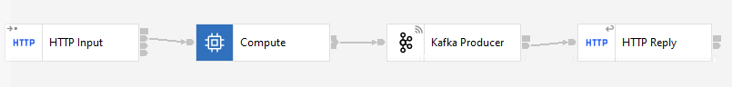


### 4c. Configure KakfaProducer Message Flow Nodes<a name="configure-kafkaproducer-nodes"></a>

Click on the **HTTP Input** Node. <br>
Set "Path suffix for URL": /flight-landings <br>


Change Input Message Parsing as "JSON". <br>
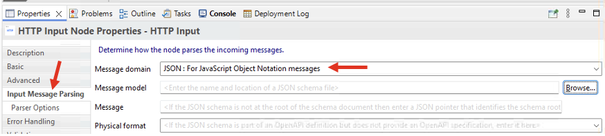


Click on the **Compute** Node. <br>


Uncomment ESQL lines. <br>


Click on the **Kafka Producer** Node. <br>


Policy Tab. <br>
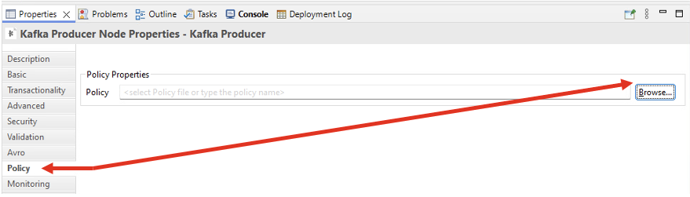


Click, Create a policy link. <br>


Create a new Policy project. <br>


Name it "MyPolicies" and click Finish. <br>


Enter Policy name as "KafkaPolicy". <br>


Select Template as Kafka. <br>

Confirm to switch policy or template ... click OK. <br>
Populate the Kafka connection properties. <br>
Bootstrap server: <br>
Security Protocol: SASL_SSL <br>
SASL Mechanism: SCRAM_SHA_512 <br>
Secrity Identity: kafkaCred <br>
SASL config: org.apache.kafka.common.security.scram.ScramLoginModule required; <br>
SSL truststore location: C:\Users\techzone\Downloads\es-cert.p12 <br>
SSL truststore type: PKCS12 <br>
SSL truststore security identity: kafkaTrust <br>
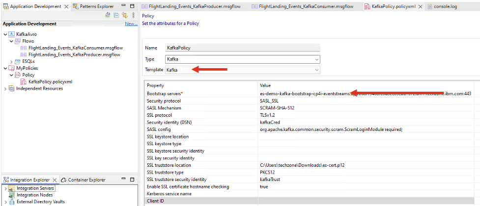

Hit Control+s to save the policy, and close the policy. <br>
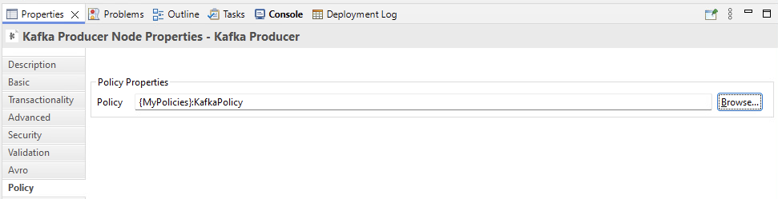

**Hit Control+s to save the Message flow.** <br>


## 5. Create Vault, Credentials <a name="create-credentials"></a>

Right click "External Directory Vault" under "Integration Explorer" view, then click on "Create an External Directory Vault". <br>


Enter directory name "C:\temp\ace-vault", and password as passw0rd. <br>
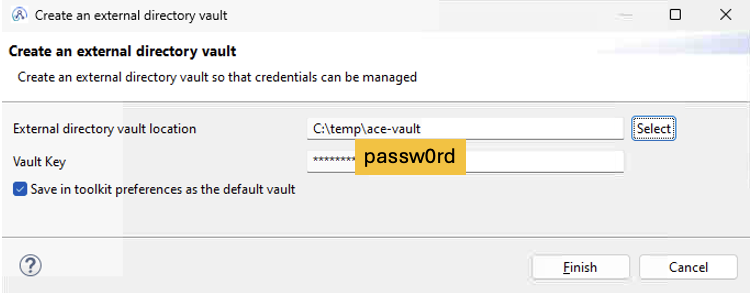

Create Credential. <br>


Create kafkaCred credential as below. Enter username, and password you captured. <br>
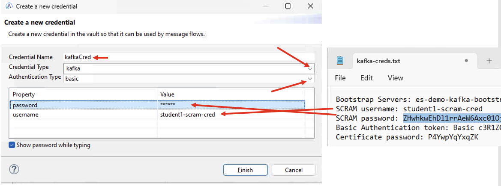

Create kafkaTrust credential as below. Enter the Certificate password that you captured. <br>
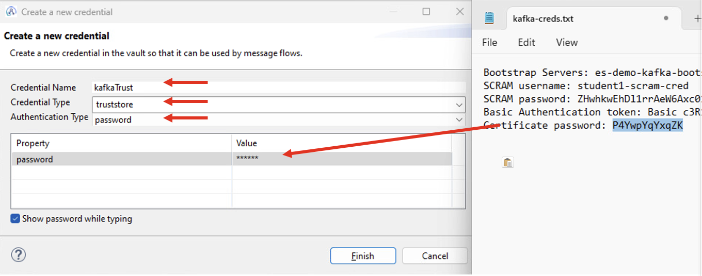

It should look like below. <br>


## 6. Deployment  <a name="deployment"></a>

### 6a. Create Integration Server <a name="create-is"></a>

Let's create Integration Server avro-demo-is as below. <br>
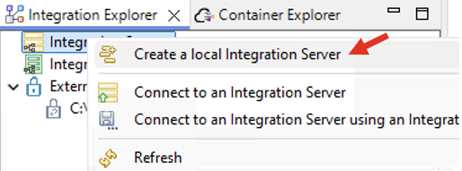

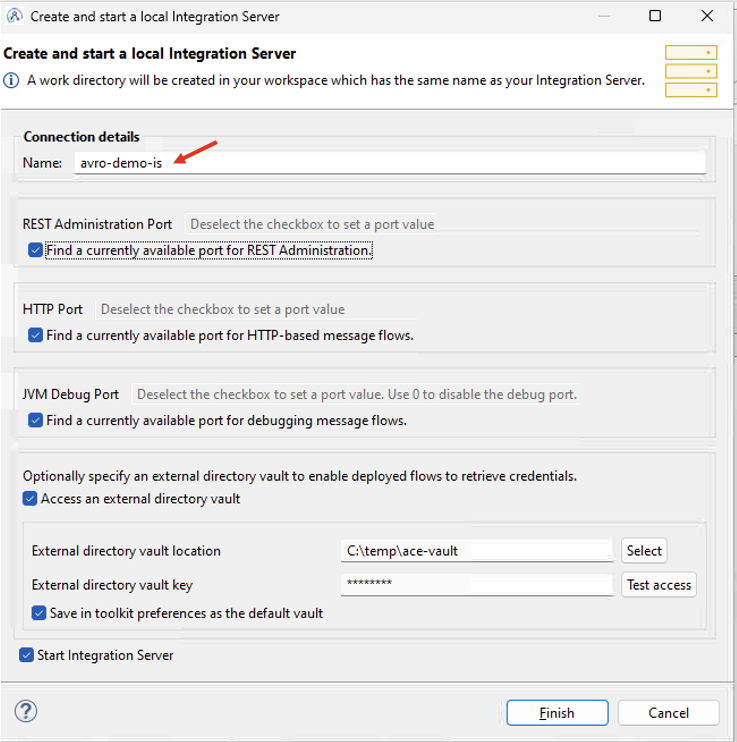


### 6b. Deploy Policy Project <a name="deploy-policy"></a>

Drag and deploy the MyPolicies project into avro-demo-is Integration Server. <br>


### 6c. Deploy Application <a name="deploy-app"></a>

Drag and deploy the KafkaAvro Application into avro-demo-is Integration Server. <br>

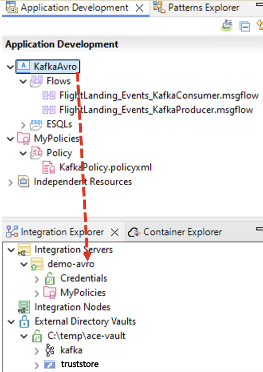

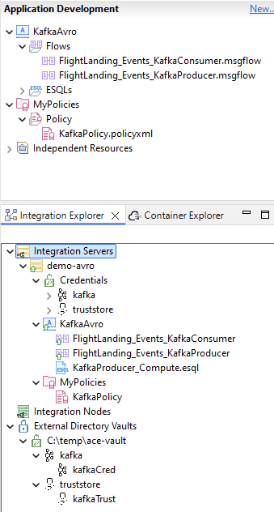

<br><br>


## 7. Testing <a name="testing"></a>

On the Windows VM, open Command Line. Then copy/paste the below command. <br>

```
curl http://localhost:7800/flight-landings -d "{\"timestamp\":\"2025-11-13T01:29:44.192618\",\"location\":\"Orlando, FL\",\"airport\":\"MCO\",\"airline\":\"Saudhi Airlines\",\"flight\":\"SA623\",\"terminal\":\"E\",\"gate\":32,\"passengers\":28}"
```


Output... <br>

<br>

Now, lets check the Topic in Event Streams and make sure the Event is created. <br><br>

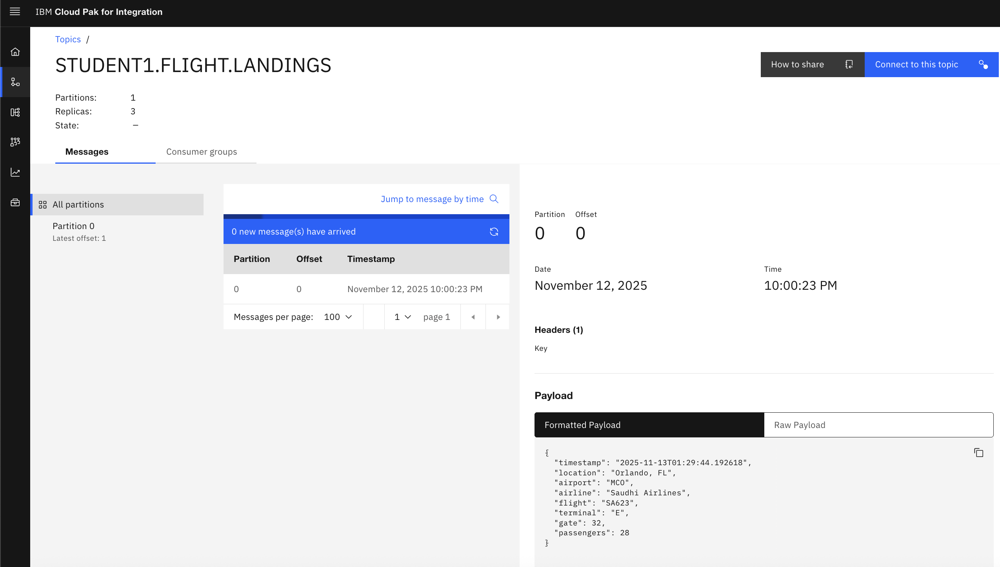

Flight_Landings_KafkaConsumer Message flow should have received the event and written to C:\temp\flight-landings.out file. Use Notepad++ and check the data. <br>

NOTE that we do not have any validation to the JSON event. We will now use the AVRO schema to validate our JSON. <br>


## 8. Using Avro schema <a name="using-avro"></a>

Now, lets use the Avro schema (FlightLandings.avsc) to serialize the data into the Topic. <br>

The FlightLandings schema looks like below. <br>
```
{
    "type": "record",
    "name": "flightlandings",
    "namespace": "flightdata",
    "fields": [
        { "name": "timestamp", "type": "string" },
        { "name": "location", "type": "string" },
        { "name": "airport", "type": "string" },
        { "name": "airline", "type": "string" },
        { "name": "flight", "type": "string" },
        { "name": "terminal", "type": "string" },
        { "name": "gate", "type": "int" },
        { "name": "passengers", "type": "int" }
    ]
}
```
The schema FlightLandings.avsc is located in C:\workshop\schemas\avro folder. <br>
<br>


### 8a. Create Avro Policy <a name="create-avro-policy"></a>

Back to App Connect Toolkit, and Flight_Landings_KafkaProducer Message Flow, click on KafkaProducer node then Avro tab. <br>


Click Browse, then "Create Policy" to create Avro policy. <br>

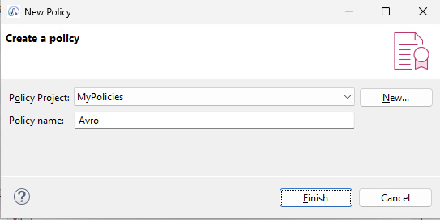

Select Template "Schema Registry". <br>
Schema Registry Type: File. <br>
Schema Registry URL: file://C:/workshop/schemas/avro


For this lab, we will just use local Avro file registry, but you could use Schema Registry of Event Streams. <br>

Save, and close the Policy. <br>

<br>
Now, we need to populate Schema ID, which in this case it's FlightLandings. <br>


## 9. Redeploy Policy and Application <a name="redeploy"></a>

Drag and drop the MyPolicies and KafkaAvro application into the Integration server demo-avro. <br>

<br>

## 10. Testing Avro <a name="testing-avro"></a>

Run the below curl command to send second flight landings event. <br>

```
curl http://localhost:7800/flight-landings -d "{\"timestamp\":\"2025-11-13T02:30:45.192618\",\"location\":\"New Delhi, IN\",\"airport\":\"RGV\",\"airline\":\"Air India\",\"flight\":\"AI601\",\"terminal\":\"A\",\"gate\":11,\"passengers\":401}"
```

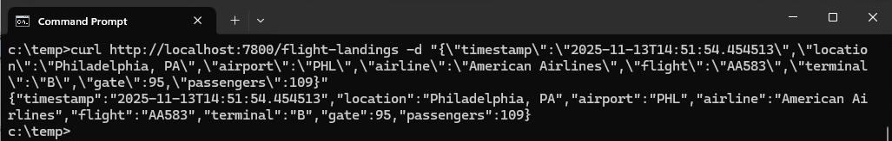

Check Event Streams Console and make sure the data is serialized as below. <br>

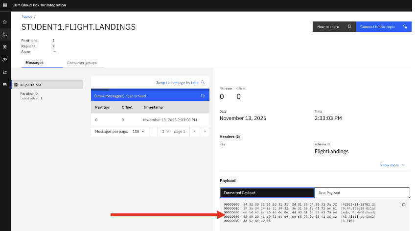

## 11. Summary <a name="summary"></a>

Congratulations! You have effectively utilized Avro-based schemas with the IBM App Connect KafkaProducer node and examined the process of serialization.. 
<br><br><br>