# Unit Testing

---

# Table of Contents
- [1. Introduction](#introduction)
- [2. Workshop Environments ](#workshop-env)
- [3. App Connect Toolkit](#toolkit)
  * [3a. Import Unit Test Tutorial](#import-tutorial)
  * [3b. Download input, and output message files](#import-messages)
  * [3c. Generate Unit Testing Project](#generate-unit-testing)
  * [3d. Run good test](#run-good-test)
  * [3e. Simulate a Failure Test - Modify MyJSONSchema.json ](#simulate-fail-test)
  * [3f. Run failure test ](#run-fail-test)
- [4. Summary ](#summary)

---

<br>

## 1. Introduction <a name="introduction"></a>
In this lab, you will explore how to use Unit Testing with App Connect Toolkit <br>


## 2. Workshop Environments  <a name="workshop-env"></a>


You will be doing this lab from the Windows VM. <br>


## 3. App Connect Toolkit <a name="toolkit"></a>


### 3a. Import Unit Test Tutorial <a name="import-tutorial"></a>

Open IBM App Connect Enterprise Toolkit from the Windows VM Desktop. <br>

Workspace: C:\Users\techzone\IBM\ACET13\workspace\unit_testing <br>
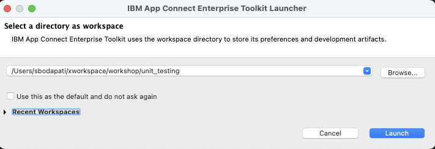

Close the welcome page. <br>

Click on Tutorials. <br>
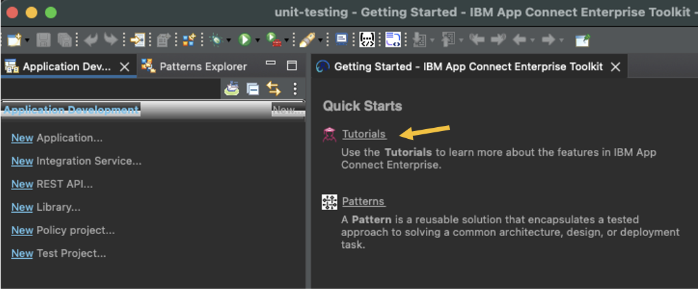

Click "Getting started - Creating a Simple Unit Test". <br>


Click Start, then "Import Project". <br>

This will open Message Flow. <br><br>


<!--
### 3b. Create local Integration Server TEST_SERVER <a name="generate-unit-testing"></a>

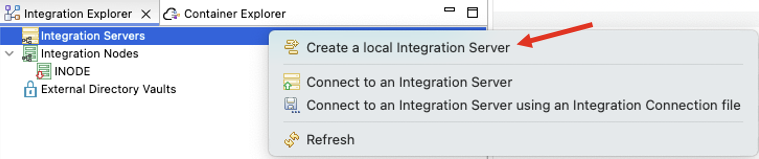

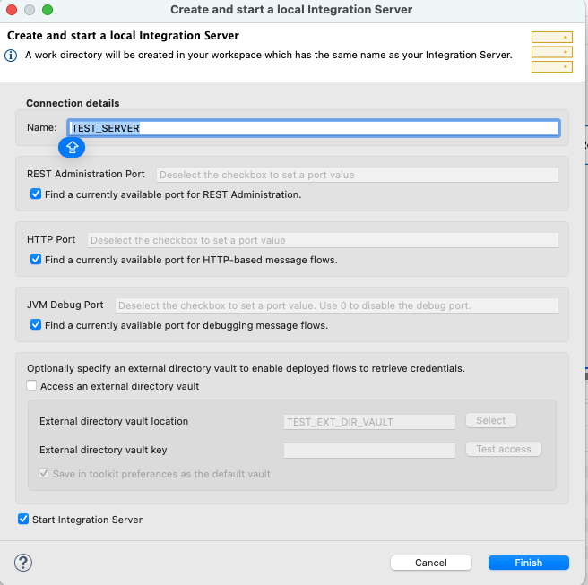

Run flow using Flow Exerciser. <br>
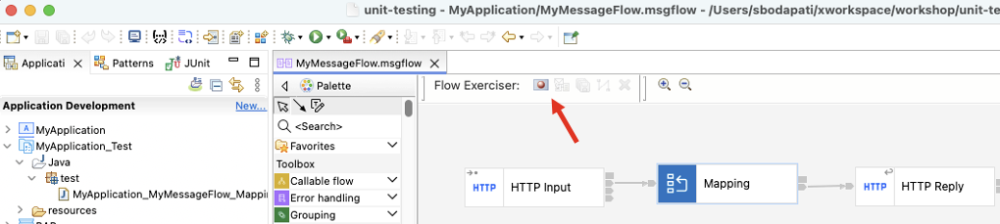
That will deploy the flow into the TEST_SERVER. <br>

Now, click send mesaage. <br>
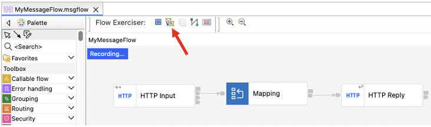

Select "inputMessage" and click Send. <br>


Check the input and output messages. <br>


Save the Output Message. <br>

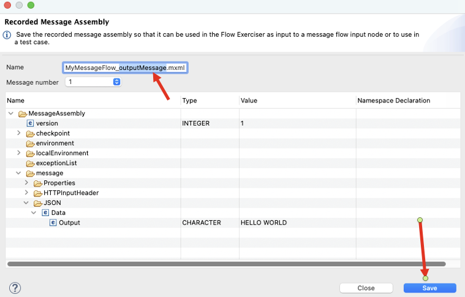

By now, we should have Input and Output Recorded messages. <br>
-->

<!--
### 3b. Create sample Output.json file <a name="generate-unit-testing"></a>


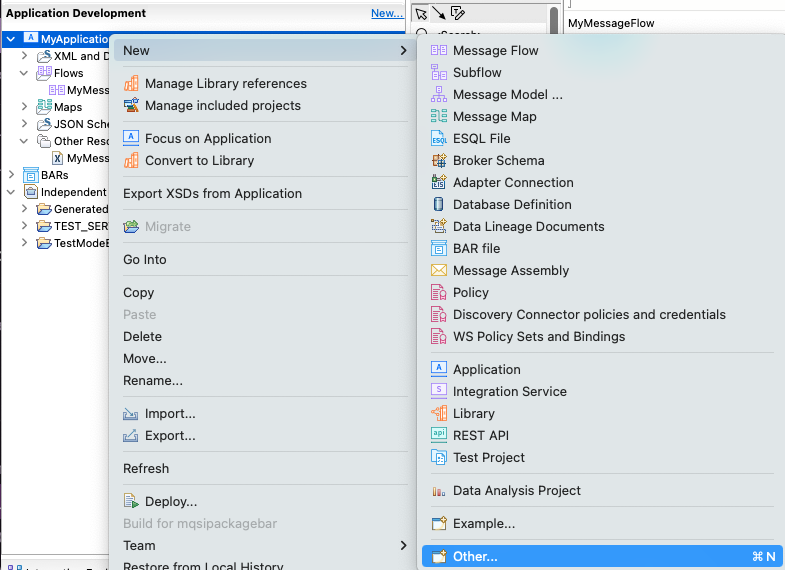

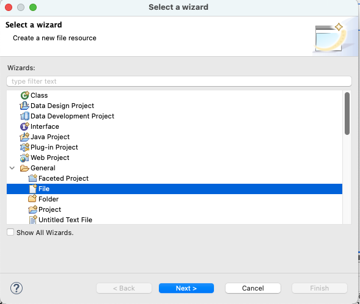

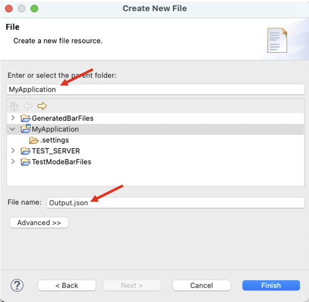

```
{
  "Output" : "HELLO WORLD"
}
```
-->

### 3b. Download input, and output sample data files <a name="import-messages"></a>

Download input.xml, and output.json files. These are the actual input and output message formats that will be used by Unit Testing framework. <br>
[<b><u>input.xml</u></b>](./resources/input.xml) <br>
[<b><u>output.json</u></b>](./resources/output.json) <br>

Drag into Toolkit MyApplication folder. <br>
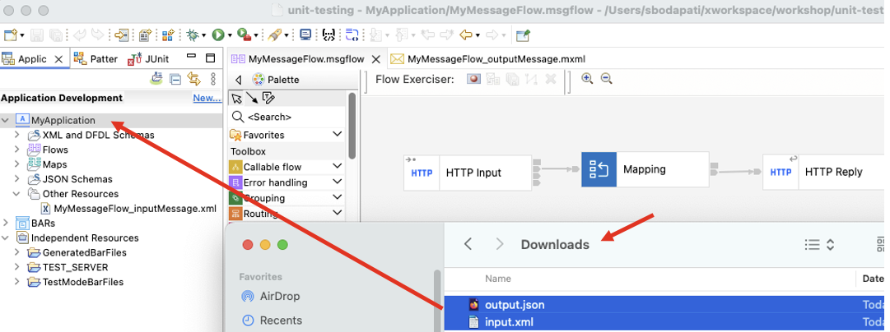

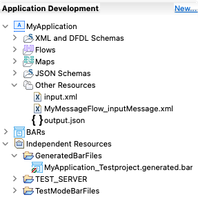

<br>


### 3c. Generate Unit Testing Project <a name="generate-unit-testing"></a>

Open MyMessageFlow message flow, and right click on the Mapping node, and select "Create Test Case". <br>
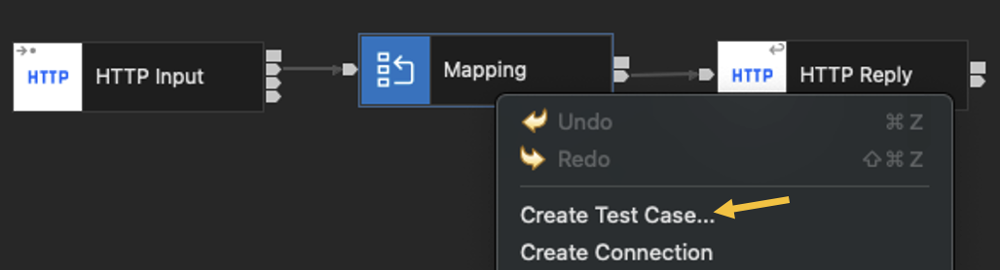


Browse and select Input and Output sample message files. <br>
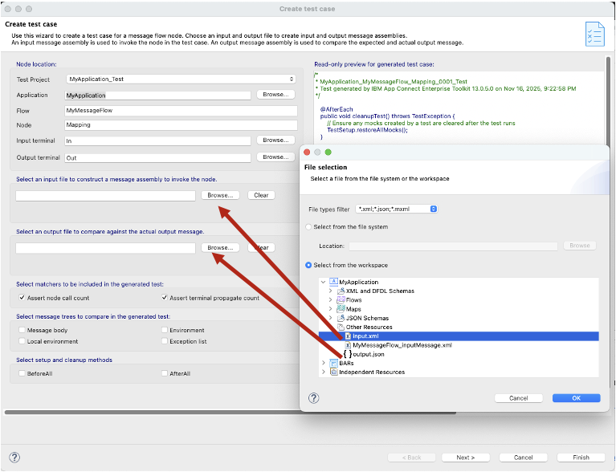

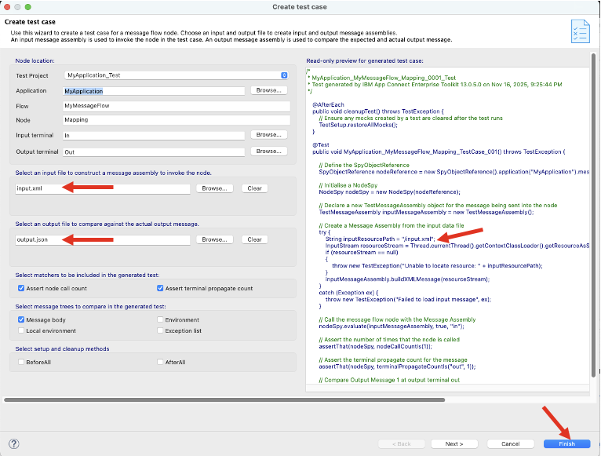

Click Finish on the next screen. That should generate a TestProject and Testcase. <br>


### 3d. Run good test <a name="run-good-test"></a>

Right click on the project and click "Run Test Project". <br>
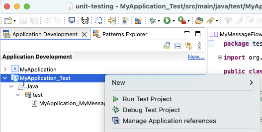

The test should run successfully, check Console log view, <br>
Which means, the Generated output message is complaint with the OutputMessaage.json schema format. <br>

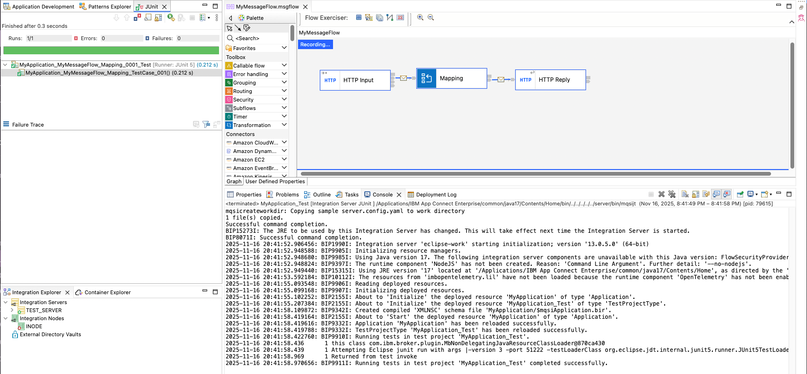


### 3e. Simulate a Failure Test - Modify MyJSONSchema.json <a name="simulate-fail-test"></a>

MyJSONSchema.json schema is being used by the Mapping Node, lets alter this so that the Mapping node will output a different format or structure which isn't expected by the Unit Testing. <br>

Open MyJSONSchema.json and replace "Output" field with "Dummy". <br>
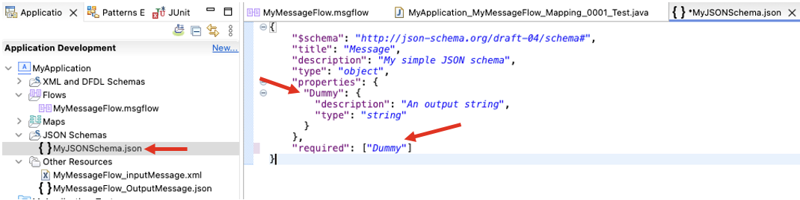

Save the MyJSONSchema.json Schema. <br>
<br>


### 3f. Run failure test <a name="run-failure-test"></a>

Right click on the project and click "Run Test Project". <br>


The test should fail, check Console log view, <br>
Which means, the Generated output message is NOT complaint with the OutputMessaage.json schema format. <br>

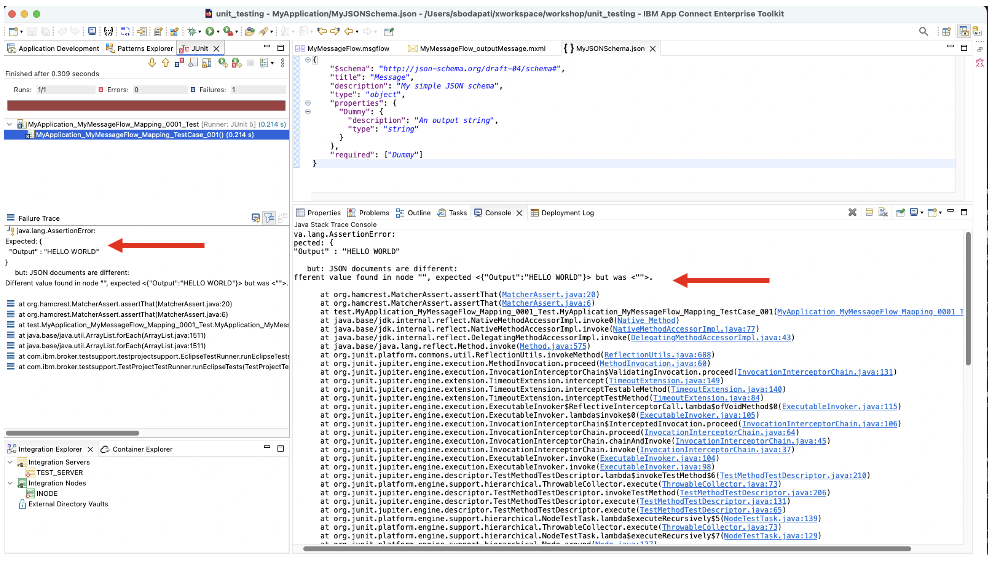


## 4. Summary <a name="summary"></a>

Congratulations! You have explored how to use basic Unit Testing with IBM App Connect. <br>

<br><br><br>