# Using Log Node


---
# Table of Contents
- [1. Introduction](#introduction)
- [2. App Connect Toolkit](#toolkit)
- [3. Import Tutorial](#tutorial-import)
- [4. Log Nodes](#log-nodes)
  * [4a. Configure Log Node 1](#log-node1-configure)
  * [4b. Configure Log Node 2](#log-node2-configure)
- [5. Create Integration Server TEST_SERVER](#create-is)
- [6. Flow Exerciser Testing ](#testing)
  * [6a. Test valid message ](#test-valid-message)
  * [6b. Test invalid message ](#test-invalid-message)
- [7. Summary ](#summary)
---

<br>

## 1. Introduction <a name="introduction"></a>

In this lab, you will explore App Connect Enterprise (ACE) Toolkit Log Node. We have introduced Log Node in ACE v12.0.11.x, this node allows you to write log entries to the Activity log. <br>


## 2. App Connect Toolkit <a name="toolkit"></a>

Open IBM App Connect Toolkit, and workspace /home/<user>/workspace/ace-workshop. <br>
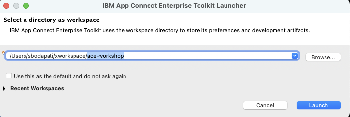

You will be greeted with the IBM App Connect Enterprise Toolkit Welcome page. <br>
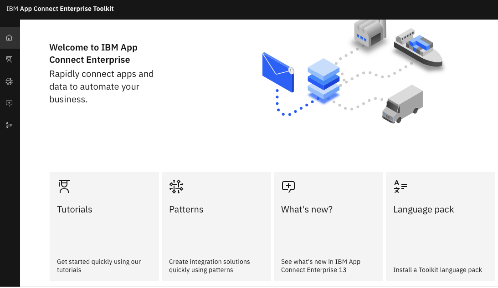


## 3. Import Tutorial <a name="tutorial-import"></a>

Click on the **Tutorials** tile. <br>

Search for "Validate". <br>


Select "Using a Validate node to check a message against a JSON schema" tutorial. <br>


Click Start button. <br>


Click Import button. <br>


That should import ValidateJSON.msgflow. Minimize the side Tutorial pane. <br>
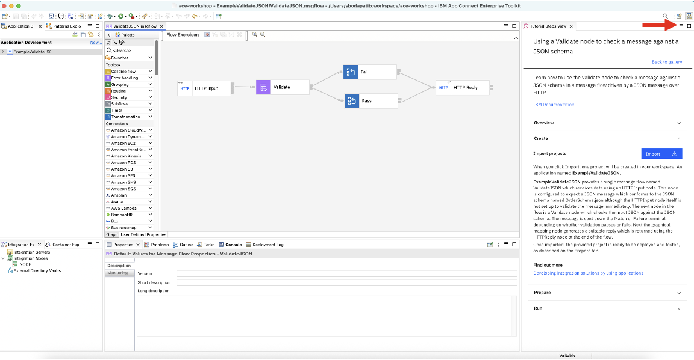


## 4. Log Nodes <a name="log-nodes"></a>

Now add Log nodes into the Message Flow canvas. Drag Log Node(s) into the Flow Canvas as below. <br>
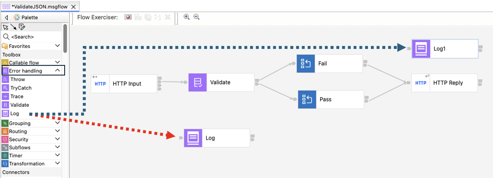


Rewire the nodes as below. <br>
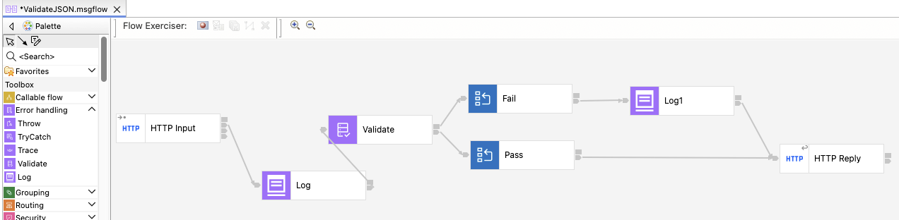


### 4.1. Configure Log Node 1 <a name="log-node1-configure"></a>

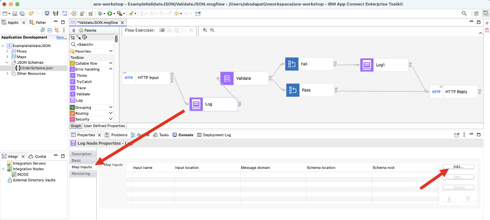

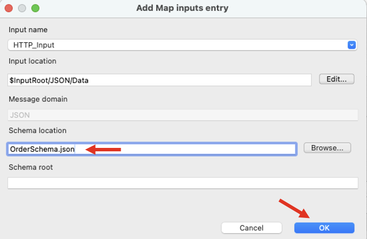


Click on the Basic Tab, and Configure button. <br>
For the Message detail, enter "Received an order in flow: ", and add Timestamp, Flow Name, Application fields as below. <br>
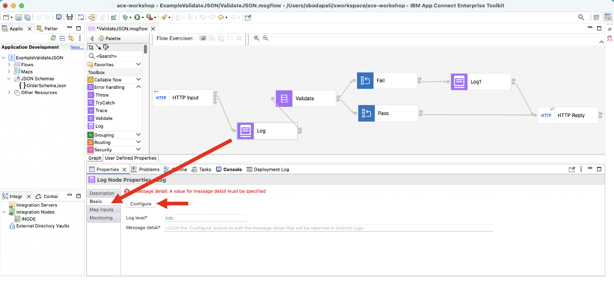


Add timestamp. <br>
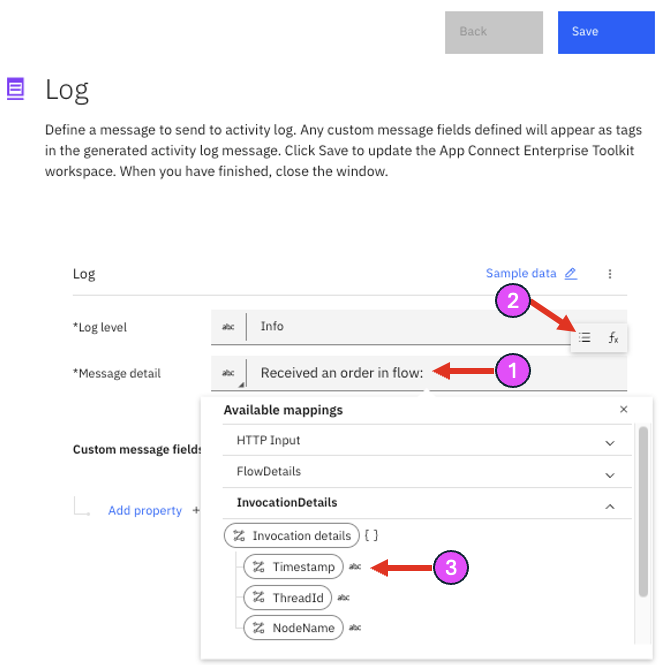

Add "Flow Name", and "Application Name". <br>
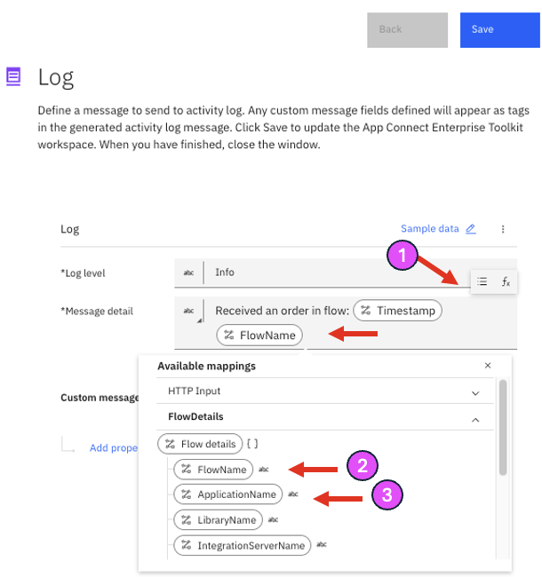

Add a custom field "Order", click "Add property". <br>
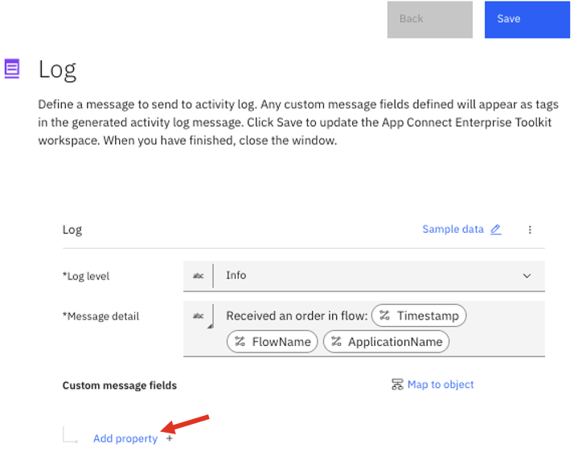

Enter Order, and type String...then, click "Edit Mappings". <br>

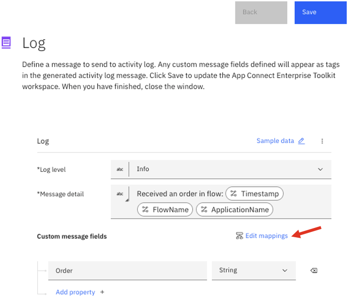

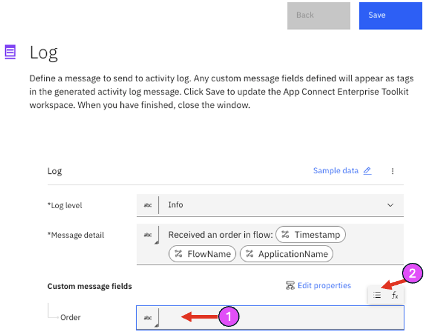

Select Order object under Http Input > Payload > Order segment as below. <br>


Save, and close the window. <br>
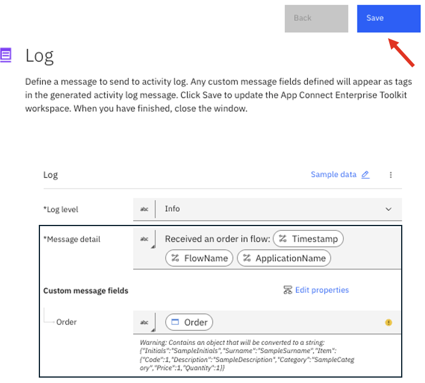

Now, you can see that the Log node is configured with JSONata expression. <br>


<br>


### 4.2. Configure Log Node 2 <a name="log-node2-configure"></a>

We will add ExceptionList tree object. <br>

Click on Log Node 2, and Map Inputs tab. <br>
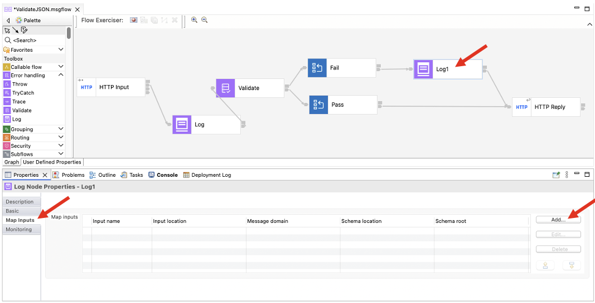

Add **ExceptionList**. <br>
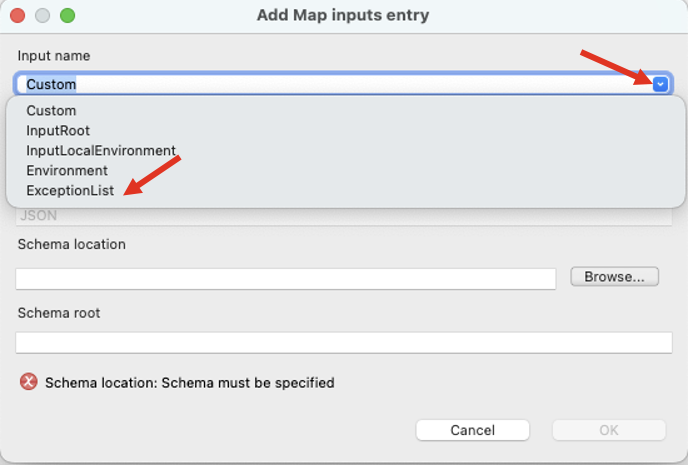

Click **OK**.<br>
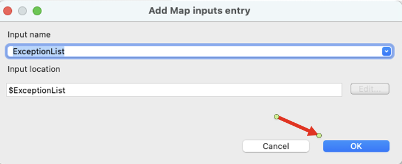

Now, click on the Basic tab, then Configure button. <br>


For the "Message detail", enter "Error occurred while validating the mnessage in flow: <br>
Add "Flow Name", "Application Name" from the Flow Details segment. <br>
Also, add Property "ErrorMessage" and copy/paste the below JSONata expression into the value textbox. <br>

```
\{\{$map\($mappingInput_ExceptionList.Insert, function\($v\) \{$v.Text\}\)\}\}
```
<br>


Hit the Save the configuration. <br><br>


## 5. Create Integration Server TEST_SERVER <a name="create-is"></a>

Follow the screenshots. <br>
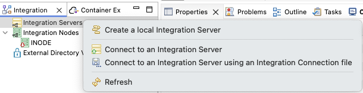

Click "Finish". <br>

<br>

## 6. Flow Exerciser Testing <a name="testing"></a>

Start the Flow Exerciser per screenshots below. <br>
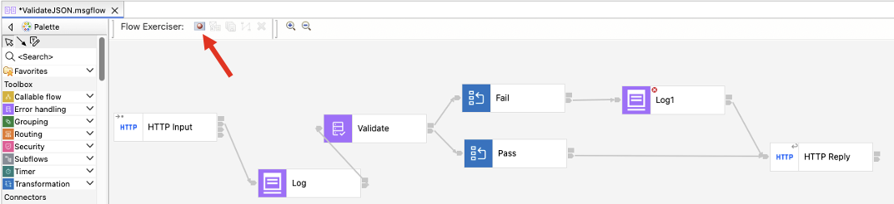


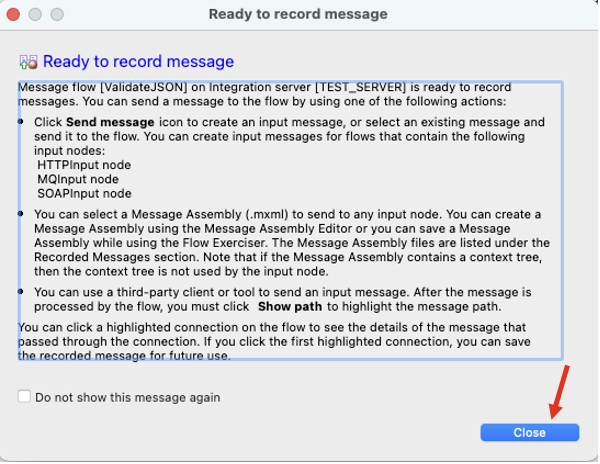

<br>


### 6a. Test valid message <a name="test-valid-message"></a>

Click "Send a message to the flow". <br>

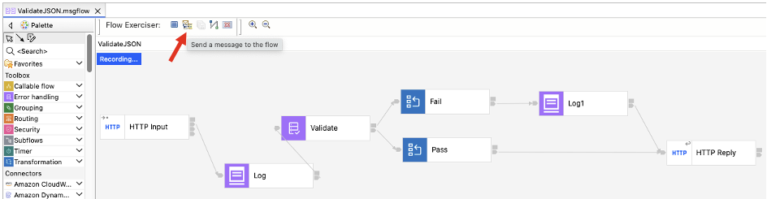

select "ValidationPaass" input message, and click "Send". <br>


Check the response. <br>


Close the window.<br>

Open the **Web UI** for the **Integration Server**. <br>


You will get **"Your connection is not private"**, click **Advanced** and **Proceed**. <br>

Click on the Application, then click on the Message Flow "ValidateJSON". <br>
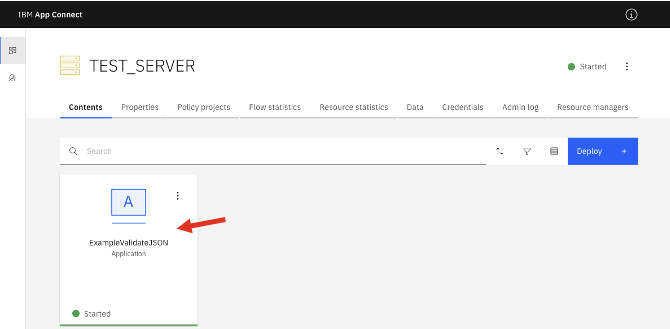

Now click on the **"Activity Log"**. <br>
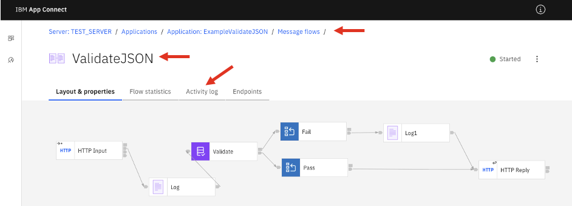

Now, click on **"Fetch actitivity log"** <br>


Notice the Order was validated successfully and a log entry has been created as well. <br>
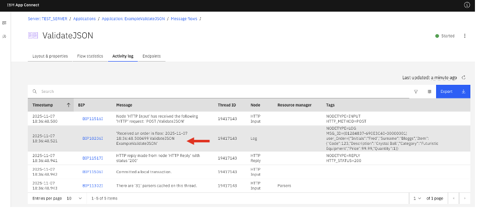


### 6b. Test invalid message <a name="test-invalid-message"></a>

Go back to the Toolkit and send Invalid JSON message. <br>
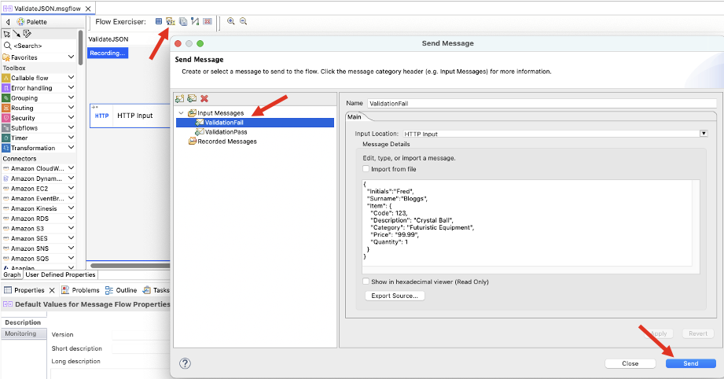


You should receive "The input message FAILED validation". This is because the price value is a String instead of integer. <br>
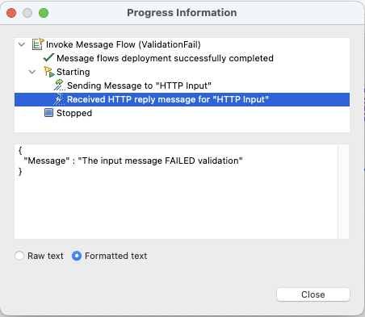

Now, lets go back to the **Integration Server**'s **Web UI**, and refresh the Activity log. <br>

You should see the Log node's entry "Error occurred while validating the message flow". <br>
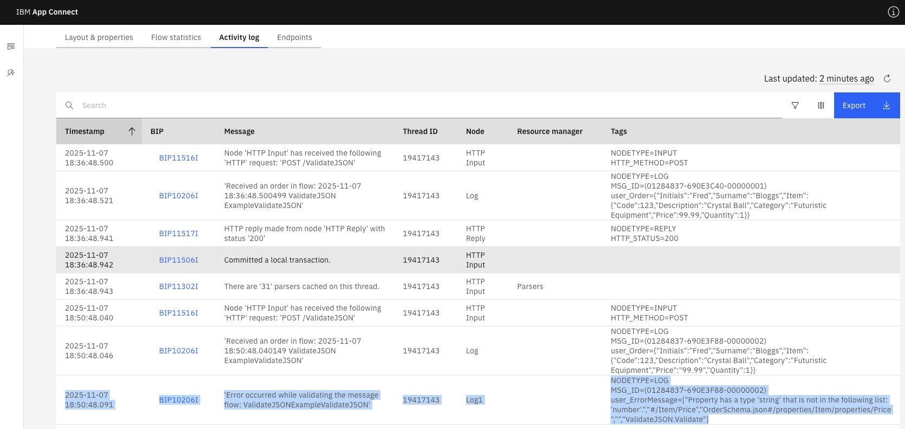

<br><br>


## 7. Summary <a name="summary"></a>

You can output the Log node generated entries into the Console log as well. You need to update the Integration Server's server.conf.yaml and restart the Integration server to be able to pickup the changes. <br>

```
ActivityLog:
  ActivityLogTemplate:
    enabled: true
    consoleLog: false
    consoleLogFormat: 'text'
```

Congratulations! You have successfully added Log node into your message flow and observed the Log entries in the Web UI's Activity log. 


<br>